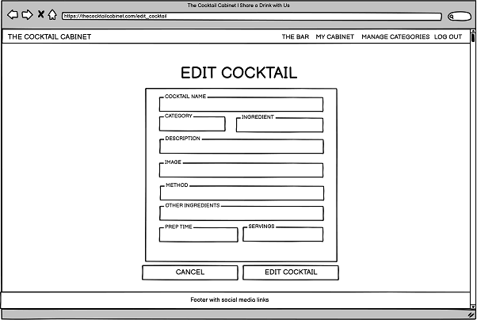
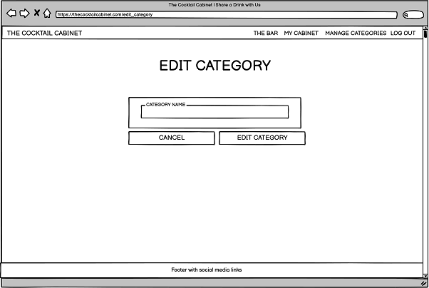
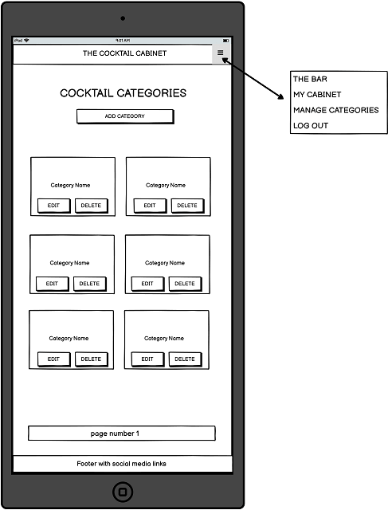
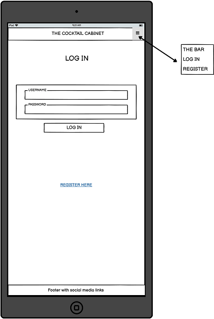
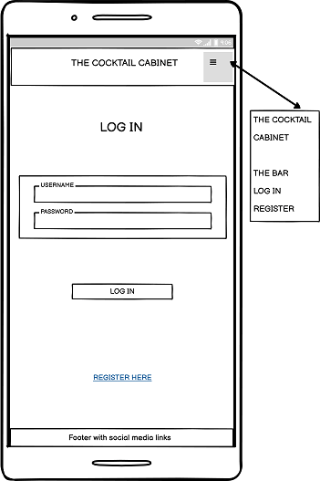

<h1 align="center">The Cocktail Cabinet</h1>

[View the live project here.](https://ms3-final-cocktails.herokuapp.com/)

Welcome to a brand new cocktail recipe website: The Cocktail Cabinet.

<h2 align="center"></h2>

The Cocktail Cabinet for the Milestone Project 3, for [Code Institute's](https://codeinstitute.net/) Diploma in Web App Development.

The Cocktail Cabinet is a passion project, with its idea birthed from the depths of a continious and a seemingly neverending lockdown during the COVID-19 pandemic. Just like many others, the creator discovered a range of hobbies and projects ranging from the wholesome and worthwhile to the downright forgettable (or wish to forget?). Some of those interests stuck around and become a part of everyday normality, others were left behind and to never be spoken about again. Thankfully, cocktail making and drinking (responsibly) remained. The creator has a desire to share that love with a greater audience: those new to cocktails, other like-minded people, creative minds and curious tipple chasers - all are welcome to discover, share and enjoy! The creator is excited to launch The Cocktail Cabinet and hope to attract more and more cocktail lovers from across the world.


# Table of Contents
1. [Website Concept](#website-concept)
1. [Project Goals](#project-goals)
2. [User Stories](#user-stories)
    - [As a New User](#as-a-new-user)
    - [As a Returning User](#as-a-returning-user)
    - [As an Admin](#as-an-admin)
4. [Aesthetic Design](#aesthetic-design)
    - [Wireframes](#wireframes)
        - [Desktop](#desktop)
        - [Tablet](#tablet)
        - [Mobile](#mobile)
    - [Colour Palette](#colour-palette)
    - [Images](#images)
    - [Font](#font)
3. [Data Schema Design](#data-schema-design)
5. [Technical Design](#technical-design)
5. [Accessibility](#accessibility)
6. [Features](#features)
4. [Technologies Used](#technologies-used)
    - [Languages Used](#languages-used)
    - [Frameworks, Libraries, Programs and Tools Used](#frameworks-libraries-programs-and-tools-used)
7. [Testing](#testing)
7. [Future Updates](#future-updates)
8. [Initial Setup and Deployment of The Cocktail Cabinet](#initial-setup-and-deployment-of-the-cocktail-cabinet)
9. [Credits](#credits)

### Website Concept:

A website open to all above the age of 18 (due to drinking age). The The Cocktail Cabinet is a fully interactive and social website, with it's purpose to find, share and enjoy cocktail and mocktail recipes.

Visitors can browse through the website and even search through the current user-uploaded recipies, or for even more cool features - they can sign up for free to open up The Cocktails Cabinet's true potential and unique attraction. These features annd possibilities will be not only obvious from the website, but will also be explained in detail throughout this README document.

The website will clearly display information for new and returning customers including the creators contact information via social media links. The website is fully responsible on a range of devices - from hand-held devices to larger screens such as monitors and even TVs. This is to ensure that as many people as possible can visit the website.

The website is welcoming to a range of visitors, and gives a very nice user experience with plenty of on-screen prompts (explained here[Features](#features)) on dispaly and a whole host of fancy tech working in the background to ensure a smooth and user-friendly experince.

The website can store enough cocktail recipes to fill your home bar tenfold, along with every other users recipes.
By signing up, the user has even more access and capabilities such as adding, editing, liking and commenting on cocktail recipes.

### Project Goals:

The main brief for this project is to showcase the CRUD featuresa of both a relational and a non-relational database management ssytem. The goal is to combine a conventional relational database (postgreSQL) and a non-relational database (mongodb) and to allow them to work seemlessly together, with the ability to link both databases with no impact on the user experience. By combining both, the project can serve multiple approches to database management and CRUD functionality.

The website is a full stack project that aims to showcase the creators backend and frontend development skills, learned during the MS3 portion of the course. Code Institute's brief was to develop a project that utilized both a conventional relational database and a non-relational database, and aim for them to synchronize and link data. A focus on CRUD functionality.

## User Stories

Following are the goals that the website should provide for each user.

#### As a New User :
* 001 - I want to to be able to access and view the website on the device I'm using.
* 002 - I want to to be able to navigate the website with ease.
* 003 - I want to to be able to understand the website immediately.
* 004 - I want to to be able to view guidence or some form of help if needs be.
* 005 - I want to to be able to contact the website developers if I wish to.
* 006 - I want a reason to return.

#### As a Returning User :
* 007 - I want to find information about the company's background, their story and growth.
* 008 - I want to find the best way to get in contact with the company with any questions I may have.
* 009 - I want to be able to contact the company in many different ways.
* 010 - I want to be able to view my own cocktail recipes.
* 011 - I want to be able to add my own cocktail recipes.
* 012 - I want to be able to edit my own cocktail recipes.
* 013 - I want to be able to delete my own cocktail recipes.
* 014 - I want to to be able to access and view the website on a range of devices/browsers.

#### As an Admin :
* 015 - I want to have more control than any other user.
* 016 - I want to be able to view more data than other users.
* 017 - I want to be able to add data to the website.
* 018 - I want to be able to edit data from the website..
* 019 - I want to be able to delete data from the website.


## Aesthetic Design
Once the user goals and the projects intentions were set out, the next step was to design the aesthetic aspects of the The Cocktail Cabinet.

- User NOT logged in


- User logged in


- Admin logged in


### Wireframes
Wireframes were drawn using [Balsamiq](https://balsamiq.com/) at the beginning of the project. They were referenced throughout the design and building of the website. Following are a series of images showing The Cocktail Cabinet on the three main screen sizes: desktop, tablet and mobile. Every major section of the website is also included.

#### Desktop

- Home Page Wireframe


- The Bar / All Cocktails Wireframe


- Filtered Cocktails Wireframe


- View Cocktail Wireframe


- My Cabinet / Profile Wireframe


- Add Cocktail Wireframe


- Edit Cocktail Wireframe



- Manage Categories Wireframe


- Add Category Wireframe


- Edit Category Wireframe



- Log In Wireframe


- Register Wireframe


#### Tablet

- Home Page Wireframe


- The Bar / All Cocktails Wireframe


- Filtered Cocktails Wireframe


- View Cocktail Wireframe


- My Cabinet / Profile Wireframe


- Add Cocktail Wireframe


- Edit Cocktail Wireframe


- Manage Categories Wireframe



- Add Category Wireframe


- Edit Category Wireframe


- Log In Wireframe



- Register Wireframe


#### Mobile

- Home Page Wireframe


- The Bar / All Cocktails Wireframe


- Filtered Cocktails Wireframe


- View Cocktail Wireframe


- My Cabinet / Profile Wireframe


- Add Cocktail Wireframe


- Edit Cocktail Wireframe


- Manage Categories Wireframe


- Add Category Wireframe


- Edit Category Wireframe


- Log In Wireframe



- Register Wireframe


### Colour Palette
- The colour palette is simply dark against light and vice versa. Black and white. There is some range of brighter colours for the [interactive elements](#interactive-element) in an effort to highlight these and make a drastic contrast between interactive elements and non-interactive content. This contrasted well with what is predicted to be a fairly vast range of imagery chosen by the users - with cocktails covering every colour imaginable, often vibrant and bright. The main background hero-image (bg.jpg) provides an array of browns, yellows, black and some shaded/darker colours. It aims to evoke a cool and mysterious mood - inspired  by some of the cocktail bars the creator has visited.

- By default, all buttons have a consistent style, size and layout throughout the website. See more in the buttons [Features](#features) section.

- The text colour is white (rgb(255,255,255)) for the website's footer and navbar and also when placed upon larger images and cocktail imagery. This ensures a constant and obvious contrast between text and any background content or colours. When the background is much lighter, the text colour is reversed to black (rgb(0,0,0)), again to ensure clarity.

- The headings are white text, allowing the background image to be seen, but not interfere too much with the flow and visibility of the content. When text appears on top of cocktail images and recipes, the black text is contrasted by a slightly transparent white background to help readability and highlight the text.

- Some shadows (slightly opaque black) are added to interactive elements and cards to help with depth and contrast. When the shadow appears on cursor hover, they serve as hints to the user that that element can be interacted with.


- It was decided early on in the design stage that the black colour would be important for the website. Some of the other colours were chosen around having this colour in mind, especially to ensure the imagery and text was the focal point.

- Here is the [Contrast Checker](https://webaim.org/resources/contrastchecker/) tool used to show just how powerful something so simple can be:


Further contrast checks were made in the [Testing](TESTING.md) documentation, especially during Lighthouse checks. Adjustments were made to favour readability.


### Images
- The use of photography is vital in creating allure and desire, especially for this cocktail recipe website. Users are drawn by what they see. The bg.jpg background image is large and provides a fantastic colour to build an interface on. This inspired more imagery to be used for 'The Bar' and 'My Cabinet' pages especially.

- It's vital for the theme to be clear and obvious. The background image makes the website recognizable and memorable so people recall and return to it, which will draw more eyes to the website. This, along with the CSS styling and colour palette solidifies the theme.

### Font
-  The The Cocktail Cabinet uses the Poppins font. It provides that clean and clear style without compromising on readability - a vital design feature for any website. This is available for free via [Google Fonts](https://fonts.google.com/) and imported via CSS. Sans Serif is used as a secondary option in case of failure to import the font into the website correctly. Poppins is a font often used in designs, so it is both attractive and appropriate.

## Data Schema Design
Here is the Database Schema layout for The Cocktail Cabinet website:


It shows each collection, what data is kept, their type and how they are linked together.
This schema is vital in developing the website's functionality, its features and what users are capable of doing. A breakdown of every feature can be found here [Features](#features) along with the code, and how everything links together.

The models.py file holds the postgres side of things, and the mongodb holds the cocktail recipes. A full setup can be found here [Development](#development) These can be adjusted for future projects or an adjustment to this one by:

## Technical Design
Once the user goals and the projects intentions were set out, the next step was to design the technical aspects of the The Cocktail Cabinet.

routes.py = main CRUD functions and data manipulation are written here. Server-side control for the back-end.
models.py = posgres model template/design
run.py    = flask linking
cocktails folder = runs as the flask app with all site related content
templates folder = contains all html webpages found on The Cocktail Cabinet

Procfile - to link to Heroku


### Jinja Template

Jinja2 was used as the templating enginge. The structure is as follows:

base.html > main website structure and navigation is defined here. A base template creates a platform for all other pages within the website to extend from. All templates reference the base.htm as seen here:

```

```
```


```

### Defensive Programming
Used throughout The Cocktail Cabinet. By linking the session cookie to the username, the rest can be controlled:
```
if "user" not in session or session["user"] != "admin":
```
When not met, the current user/visitor is presented with a Flash message to inform them.

## Modal
Modals form an integral part of the websites design. They act as a reminder if the users actions were intended and creates a much more user-friendly experience. Confirming the actions throgh the modal allows the user to think again, confirm or avoid making a mistake (such as accidentally clicking a button and instantly deleting a favourite cocktail recipe).
Materializecss' modal was used and then tweaked. The button in the modal itself deletes the related data:
```
<a href="{{ url_for('delete_cocktail', cocktail_id=cocktail._id ) }}" class="modal-close btn-small red darken-1 text-shadow">Delete</a>
```

## Accessibility
Extremely important aspect.
-   Semantic design.
-   The use of alt to describe images and other content.
-   Aria-labelledby to link sections.
-   Colour and contrast considerations and testing.
-   Adding labels to forms.
-   Prompts to help guide users.

## Features
There are universal features that are present throughout The Cocktail Cabinet website. These feature are:
- Responsive on all device sizes - from 320px upwards to larger desktops reaching 1200px and more.
- Fully-responsive nav bar (including mobile nav bar)
- Mobile-friendly, adusting automatically at specific breakpoints thanks to Materializecss's easy-to-use framework and custom overriding style classes.
- The Cocktail Cabinet logo/name is seen at all times whether tucked to the left, central on reduced screen-sizes or at the top of the mobile menu on smaller and mobile devices. This is vital for brand consistency and serves as a simple way of reminding the user of the website's name. The logo is clickable and always takes the user to The Cocktail Cabinet home page (home.html).
- Clear and obvious navbar links to other pages within the website.
- Fully responsible footer which matches the design and colour palette of the top navbar.
- Social links in footer, linking to the creators social links and provides ways to contact them.
- Name of website along with copyright info in footer.
- All clickable images, buttons, links etc have a hovering cursor to signify that that element can be interacted with. The majority of these elements being visually promted either throgh a short zoom in/out animation, colour change or highlighting.
- A Flash text appears at the top of the webpage whenever a user or admin completes a task - by either adding, editing or deleting information. They are informed of this.

Here's a breakdown of all the design features on each of the main webpages within The Cocktail Cabinet website:

### - The Cocktail Cabinet home page (home.html)


The home page for The Cocktail Cabinet website. All visitors will be welcomed by this webpage. The features include:
- The user is met with a full-screen hero-image (bg.jpg) with The Cocktail Cabinet centered above. A brief text gives the website's slogan.
- A button to entice the user to 'Log In'. This button changes to 'My Cabinet' if the user is already logged in.
- Underneath the hero image, a few simple suggestions for users to follow and explore. Some guidence on what to do if new to the site, with the rounded images clickable and related to the text below. Quick links.
- Carousel. A carousel of all cocktail categories avilable on the website. Click leads to (filter_category.html) with all the related cocktails listed.

### - The Bar page (all_cocktails.html)


The Bar. This is where every cocktail recipe on The Cocktail Cabinet website is listed. All visitors to the website can view this webpage. The features include:
- Current page is highlighted on the nav bar
- The user is met with a large image (bar-big.jpg) and the title of the page (The Bar) centered to the image with a brief text description of the page purpose.
- A search bar is located just under the image, for quick, easy access for user preferred searches. The user can search by name, ingredients, alcohol, as suggested by the placeholder and either use a keyboard ENTER entry, or use the 'Search' button to search though the entire websites database of cocktail recipes.
- Reset button next to the Search bar, to clear and restart the user's search options.
- A list of every cocktail recipes on the website presented in card format, with purposefully limited but relavant information related to each cocktail recipe.
- Ability to click on each cocktail recipe image to advance to the full recipe page (view_cocktail).
- If the cocktail recipe was submitted by the user, the 'Edit' button under the cocktail recipe image forwards the user to the Edit Cocktail (edit_cocktail.html) page.
- If the cocktail recipe was submitted by the user, the 'Delete' button under the cocktail recipe image allows the user to delete the cocktail recipe. The user is met with a modal that asks for confirmation on wheither they want to delete that cocktail or not. User must click 'Delete' again to confirm this (which will then delete the cocktail recipe from the website and the database), otherwise they can cancel by clicking the 'Cancel' button or by just clicking off screen or pressing ESC on the keyboard and the cocktail recipe will remain on the website. 
- The 'Edit' and 'Delete' buttons are hidden if the user did not submit the cocktail recipe.
- A clickable link at the bottom of each seperate cocktail recipe card to advance to the full recipe page (view_cocktail).
- Pagination. A total of 9 cocktail recipes per page. The number of pages is based on the number of recipes found in the database. The user can select a specific page, or browse the list of recipes by clciking the previous or next buttons on either side of the page numbers.
- Pagination info. A small text area informing the user of the amount of recipes on the current page and the total amount of cocktails in the database.

### - Filter Cocktails by Category (filter_category.html)

The Filter Cocktails by Category page is where users can view every cocktail recipe listed in a certain cocktail category (depending on which cocktail category they choose on the previous page, home.html) All visitors to the website can view this webpage. The features include:

- Name of the selected cocktail Category displayed as the page title in large text at top of page.
- A list of every cocktail recipe within the selected cocktail Category presented in card format, with purposefully limited but relavant information related to each cocktail recipe.
- Ability to click on each cocktail recipe image to advance to the full recipe page (view_cocktail).
- If the cocktail recipe was submitted by the user, the 'Edit' button under the cocktail recipe image forwards the user to the Edit Cocktail (edit_cocktail.html) page.
- If the cocktail recipe was submitted by the user, the 'Delete' button under the cocktail recipe image allows the user to delete the cocktail recipe. The user is met with a modal that asks for confirmation on wheither they want to delete that cocktail or not. User must click 'Delete' again to confirm this (which will then delete the cocktail recipe from the website and the database), otherwise they can cancel by clicking the 'Cancel' button or by just clicking off screen or pressing ESC on the keyboard and the cocktail recipe will remain on the website. 
- The 'Edit' and 'Delete' buttons are hidden if the user did not submit the cocktail recipe.
- A clickable link at the bottom of each seperate cocktail recipe card to advance to the full recipe page (view_cocktail).

### - My Cabinet page (profile.html)


My Cabinet. This is where every cocktail recipe the user has submitted is stored. Only rgistered users(and admin) can view this page. The features include:
- Current/active page is highlighted on the nav bar
- The users username presented in large text at the top of the page.
- The 'Add Cocktail to My Cabinet' button under the username, when clicked advances to the 'Add Cocktail to My Cabinet' page.
- A list of the specific users submitted cocktail recipes presented in card format, with purposefully limited but relavant information related to each cocktail recipe.
- The 'Delete' and 'Edit' buttons visible on every cocktail recipe. As previously metioned, these have the same links and path, linked to the chosen cocktail and their data.
- A clickable link at the bottom of each seperate cocktail recipe card to advance to the full recipe page (view_cocktail).

### Add Cocktail (add_cocktail.html)


The Add Cocktail / Add Cocktail to My Cabinet page is for users to add their cocktail recipe to the website via a form. Only registered users(and admin) can use this feature. The cocktail recipe is added to The Bar (all_cocktails.html), the My Cabinet (profile.html) page and to the cocktail's collection (whichever the user selects) that can then be found through either searching The Bar, or by the carousel on the home page which then leads to the (filter_category) page. The features include:
- Placeholders and labels on all inputs serve as helpful guidence for users.
- Validation on all user inputs (see code breakdown again? validate class).
- Several inputs linked to the database (see data schema, code breakdown etc for explanation of inputs, types, data links etc.)
- Cocktail Name - The cocktail name that will be presented for all to see on the recipes image.
- Dropdown select options for user to choose the Cocktail Category their cocktail belongs to. Admin has control over which categories are added to the website/database.
- Main Ingredient - The cocktails main ingredient. Tends to be the most prominent ingredient/alcoholic spirit (but also mocktails accepted).
- Ability for user to add a URL for their cocktail image. This is validated and has some error handling linked to it (see code breakdown, error handling)
-Cocktail Description - A text input to accept the users description of their cocktail.
- Method. A maximum of 8 methods that the user can add. 'Add' a new method or 'Remove' a previous method via the linked buttons. If the user attempts to add more than 8 methods, the user is informed of this via an error message underneath the last input field. The Add and Remove buttons are disabled (via the materializecss class="disabled") if there's no need for them to be used.
- Other Ingredients and Measurments. Just like the the Method input, a maximum of 8 other ingredients can be added by the user. The user can add or remove a previous other ingredient via the linked buttons during the form filling. If the user attempts to add more than 8, the user is informed of this via an error message underneath the last input field. The Add and Remove buttons are disabled (via the materializecss class="disabled") if there's no need for them to be used.
- Preperation Time - How long it takes to prepare the cocktail.
- Servings. This is set to only accept numerical inputs, and a helpful up/down scroll number can be used instead of manually typing.
- 'Add Cocktail Button to My Cabinet'. This button submits the form to the mongodb database if all inputs are valid and met.
- 'Cancel' button. Leaves the page and returns to the users My Cabinet.

### Edit Cocktail (edit_cocktail.html)


The Edit Cocktail page is for users to edit their own cocktail recipe via a form. Only registered users(and admin) can use this feature. The cocktail edited cocktail recipe is updated when the form is submitted and found in the same places as the original recipe. The information expected from the user is the same as the add_cocktail.html page. The features include:
- Labels on all inputs with the current cocktail related data/value on each input.
- Validation on all user inputs (see code breakdown again? validate class).
- 'Edit Button'. This button submits the form to the mongodb database if all inputs are valid and met and updates that specific cocktail recipe.
- 'Cancel' button. Leaves the page and returns to The Bar page.

### - View Cocktail page (view_cocktail.html)


The View Cocktail page is where the visitor can see the full recipe for the cocktail they selected. All visitors to the website can view this webpage. The features include:
- Cocktail Name in large above the recipe.
- All data/cocktail information presented.
- A large image of the cocktail.
- 'Edit' and 'Delete' buttons if the cocktail recipe was submitted by the user (Edit and Delete buttons work the same as the others on the website).
- 'Return to The Bar' button, which redirects the user to The Bar page.

### - Manage Categories page (/get_categories)


The Manage Categories page is where admin can view all the cocktail categories available. Only the website's admin can view this webpage. The features include:
- All cocktail categories information presented in a list.
- 'Add Cocktail Category' button. When clicked, it goes to the Add Cocktail Category (add_category.html) form page.
- 'Delete' button when clicked will show the modal, just like other delete featues. The admin chooses from Delete to confirm or Cancel to return to the exit the modal.
- 'Edit' button when clicked will forward the admin to the Edit Cocktail Category (edit_category.html) form page.

### - Add Category page (add_category.html)


The Add Cocktail Category page is where the admin can add new cocktail categories to the website. These categories will then be avaiable to choose from the cocktail forms via dropdown (see add_cocktail.html and edit_cocktail.html). Again, only the admin can view this page. The features include:
- Page title in large at top of the page.
- Category Name placeholder and label on input.
- 'Cancel' button. When clicked, leaves the page and returns to the Manage Categories page.
- 'Add Cocktail Category' button. When clicked, submits the form and returns to the Manage Categories page, where the newly created category is added to the list.

### - Edit Category page (edit_category.html)


The Edit Cocktail Category page is where the admin can edit a current cocktail category. These categories will then be updated in the database and shown via the dropdown select options (see add_cocktail.html and edit_cocktail.html). Again, only the admin can view this page. The features include:
- Page title in large at top of the page.
- Category Name label  and current value in input.
- 'Cancel' button. When clicked, leaves the page and returns to the Manage Categories page.
- 'Edit Cocktail Category' button. When clicked, submits the form and returns to the Manage Categories page, where the edit category is updated on the list.

### - Log In page (login.html)


The Log In page is where visitors can enter their details and log in to their account. All visitors to the website can view this webpage. The features include:
- 'Log In' title on top of the page.
- Username input with placeholder and validation applied.
- Password input with placeholder and validation applied.
- 'Log In' button. When clicked, the user is forwarded to their personal My Cabinet (profile.html) page.

### - Register page (register.html)


The Register page is where visitors can enter their details for the first time to register their new account. All visitors to the website can view this webpage. The features include:
- 'Register' title on top of the page.
- Username input with placeholder and validation applied.
- Password input with placeholder and validation applied.
- 'Register' button. When clicked, the user is forwarded to their personal My Cabinet (profile.html) page.


## Interactive Elements & Features
Following is a list of all interactive elements of the The Cocktail Cabinet website.

#### The Cocktail Cabinet website logo
As shown on the images below, the website logo and title is very clear and obvious. The centrepiece, always there and clickable. It serves as a constant reminder to the user about the brand and the website they are visiting. The logo itself is a clickable link (a cursor appears when hovering over), and returns the user back to the home page at any time. 


```
<a href="{{ url_for('home') }}" class="brand-logo">The Cocktail Cabinet</a>
```

#### Buttons
The buttons predominantly serve as triggers for users to achieve something they wish. An action is called on those buttons and are linked on the back-end.

#### - Main Buttons
- The larger and more focused green buttons. These are usually something the creator wants the user to click on - such as links to Log In, Register, visit My Cabinet - or something the user specifically has requested - such as Add a Cocktail to My Cabinet or Edit Cocktail - and the button click is next logical step. They are large, green and styled to look the same. A clean and clear button to make for user readability and purpose.


The button on the home.html page changes from Log In to My Cabinet depending on if the user is logged in or not. This is done by user sesssion capabilites and Jinja templating:

```

    <a href="{{ url_for('profile', username=session['user']) }}" class="btn-large green accent-4 text-shadow">My Cabinet</a>

    <a href="{{ url_for('login') }}" class="btn-large green accent-4 text-shadow">Log In</a>

```

Depending on the background image/colour, the buttons can give depth through the addition of MaterializeCSS "hoverable" class or through adusting the box-shadows to suit. This serve as a simple visual indicator for the site user.

#### - Delete, Reset and Cancel Buttons
- Due to the nature of this button and it's significance, it was decided to style this differently with a red colour. Red tends to indicate danger or a warning, and so it ensures the users double-check before clicking any of these buttons.


#### - Edit Button
- A blue button. Intentionally different to the typically green for good and red for bad.


#### - Disabled Button

Using Materializecss' .disabled class. This button is featured on the add_cocktail.html and edit_cocktail.html pages. It runs in conjuction with input fields being and added and removed via the custom javascript found in forms.js. The button remains visible, but with a muted colour and no functionality or clickable option.


#### Flash messages

Flask provides a simple to use Flash method that relays a message that appears at the top of each page to inform the user of their actions. Some examples are:


The design stems from the base.html template so that the feature is available to use from all subsequent pages. The messages themselves are written as part of the functions in the routes.py file.

```

    
        
            <div class="row flashes">
                <h4 class="center-align">{{ message }}</h4>
            </div>
        
    

```

## Technologies Used

### Languages Used

-   [HTML5](https://en.wikipedia.org/wiki/HTML5)
-   [CSS3](https://en.wikipedia.org/wiki/Cascading_Style_Sheets)
-   [JavaScript](https://en.wikipedia.org/wiki/JavaScript)
-   [Python](https://en.wikipedia.org/wiki/Python_(programming_language)
-   [Jinja2](https://en.wikipedia.org/wiki/Jinja_(template_engine)

### Frameworks, Libraries, Programs and Tools Used

1. [Google Fonts:](https://fonts.google.com/)
    - Google fonts is used to import the 'Poppins' font into the style.css file which is used on all fonts within the website.
1. [Font Awesome:](https://fontawesome.com/)
    - Font Awesome is used on all pages throughout the website to add icons for aesthetic and UX purposes.
1. [jQuery:](https://jquery.com/)
    - jQuery is used to simplify and manipulate some tasks instead of regular JS.
1. [Git:](https://git-scm.com/)
    - Git is used for version control by utilizing the Gitpod terminal to commit to Git and Push to GitHub.
1. [GitHub:](https://github.com/)
    - GitHub is used to store the projects code after being pushed from Git.
1. [Gitpod:](https://gitpod.io/)
    - Development environment to build the website.
1. [Balsamiq:](https://balsamiq.com/)
    - Balsamiq is used to create the [wireframes](#wireframes) during the design process.
1. [Eye Dropper:](https://eyedropper.org/).
    - This colour picker tool was used to to pick and experiment with colours.
1. [Coolors:](https://coolors.co/)
    - This tool was used to to setup the colour palette [here](#colour-palette).
1. [TinyPNG:](https://tinypng.com/)
    - TinyPNG is used to optimize images used in the website and documentation.
1. [Miscrosoft Paint:](https://support.microsoft.com/en-us/windows/get-microsoft-paint-a6b9578c-ed1c-5b09-0699-4ed8115f9aa9)
    - Microsoft Paint is used to crop and resize images and editing photos for the project.
1. [WPS Office:](https://www.wps.com/)
    - WPS Office is used to create the flow charts, the tables found in the [Testing](TESTING.md) and for spell-checking.
1. [Am I Responsive?:](http://ami.responsivedesign.is/)
    - Used to create the image at the very top of this document.

- PostgreSQL
- MongoDB 
- PsycoPG2 - database adapter. library for connecting Python to PostgreSQL.
- SQLAlchemy - ORM lirbary
- PyMongo
- Flask
- Flash
- dnspython
- flask-paginate
- materializecss
- heroku

## Testing

Due to the extensive testing necessary for The Cocktail Cabinet, the full documentation can be found [here](TESTING.md).

## Future Updates

There are many planned updates arranged for the The Cocktail Cabinet that include but are not limited to:

-   Introduction of more social features such as:
    - Ability to like/rate other cocktails
    - Ability to favourite cocktails and add to the users profile
    - Commenting on cocktail recipes
    - Instant social media links to share, comment, link etc
-   Link email for subscription, mail etc
-   Users able to:
    - Delete profile
    - Edit profile further
-   Give suggested Cocktail Categories to Admin
-   More admin rights such as:
    - Delete all user profiles
    - Edit all user profiles
-   Images linked to the Cocktail Categories.
-   Theme colour changes.
-   Theme/colour palette toggle.
-   +18 age restriction modal on site load
-   Affiliated links to external sites so users can pruchase alcohol, ingredients and other cocktail-related products

# Initial Setup and Deployment of The Cocktail Cabinet:

1. The Code Institute's template was used for basic setup, found [here](https://github.com/Code-Institute-Org/gitpod-full-template).
2. In the Gitpod CLI, install two python packages. Flask and SQLAlchemy to work with Postgres databases. psycopg2 is necessary to work with Postgres database. In command line type: `pip3 install Flask-SQLAlchemy psycopg2`
3. Create "env.py" file
4. Create a ".gitignore" file if you choose not to use Code Institute's template. Add `env.py` and the soon to be generated `__pyache__/` to it. All hidden and sensitive files/folders to be added here.
5. In "env.py", type following:
    ```
    import os

    os.environ.setdefault("IP", "0.0.0.0")
    os.environ.setdefault("PORT", "5000")
    os.environ.setdefault("SECRET_KEY", "any_secret_key")
    os.environ.setdefault("DEBUG", "True")
    os.environ.setdefault("DEVELOPMENT", "True")
    os.environ.setdefault("DB_URL", "postgresql:///<DATABASE>")
    ```

    The `any_secret_key` can be called whatever you wish: `os.environ.setdefault("SECRET_KEY", "any_secret_key")`or generate a random and secure password here: https://randomkeygen.com/

    Make sure to change `os.environ.setdefault("DEBUG", "True")` to "False" before deploying/launching project (only applicable in Heroku deployment if launching a live project. Unecessary if purely used for testing and development - this is actually to be done in the Heroku Config Vars on their platform, more later).

    `<DATABASE>` points to the databse to be created, in this case "my_cocktails".
6. Create a folder (in this case, folder is named "cocktails") in the root of your project.
7. Within that newly created folder, create a file called `__init__.py`
8. Write the following in the new file:
    ```
    import os
    from flask import Flask
    from flask_sqlalchemy import SQLAlchemy
    if os.path.exists("env.py"):
        import env  # noqa


    app = Flask(__name__)
    app.config["SECRET_KEY"] = os.environ.get("SECRET_KEY")
    app.config["SQLALCHEMY_DATABASE_URI"] = os.environ.get("DB_URL")

    db = SQLAlchemy(app)

    from cocktails import routes  # noqa
    ```
9. Create a "routes.py" file within the "cocktails" folder
10. Within that "routes.py" file, write the following:
    ```
    from flask import render_template
    from cocktails import app, db


    @app.route("/")
    def home():
        return render_template("base.html")
    ```
11. In root of project, create "run.py" file
12. Within "run.py", write the following:
    ```
    import os
    from cocktails import app


    if __name__ == "__main__":
        app.run(
            host=os.environ.get("IP"),
            port=int(os.environ.get("PORT")),
            debug=os.environ.get("DEBUG")
        )
    ```
13. Within "cocktails" folder, create a new "templates" folder. This is where Flask will search for any html templates to be rendered.
14. Create a new file "base.html" within the "templates" folder.
15. Within the "base.html" file, write whatever you wish to be presented on your website.
16. In the terminal, write `python3 run.py` to launch the project.
17. Add, commit and push.

# Setting up Databse - postgreSQL database:

Make sure you have postgreSQL installed locally if you are not using CI's template.
Set up the databse schema as follows:
1. Define the models by creating a "models.py" file within the "cocktails" folders
2. write the following in the "models.py" file and create the tables:
    ```
    from cocktails import db


    class Category(db.Model):
        # schema for the Category model
        id = db.Column(db.Integer, primary_key=True)
        category_name = db.Column(db.String(25), unique=True, nullable=False)

        def __repr__(self):
            # __repr__ to represent itself in the form of a string
            return self.category_name


    class Users(db.Model):
        # schema for the Users model
        id = db.Column(db.Integer, primary_key=True)
        user_name = db.Column(db.String(20), unique=True, nullable=False)
        password = db.Column(db.String(260), nullable=False)

        def __repr__(self):
            # __repr__ to represent itself in the form of a string
            return self.user_name
    ```
3. In "routes.py", import these newly created models:
    ```
    from cocktails.models import Category, Users
    ```
4. Log in to postgreSQL terminal by typing psql in terminal.
5. Type `CREATE DATABASE cocktails;`
6. Then `\c cocktails;` to connect to the newly created database.
7. Finally `\q` to exit.
8. Use python to generate and migrate the models into the database. if any changes are made to this database, you must repeat the same steps to refresh and update your database. in the terminal, type `python3`.
9. Type `from cocktails import db`
10. Type `db.create_all()`
11. If you wish to check that the tables exist, type `psql -d cocktails` followed by `\dt` then `\q` to quit, otherwise just exit via `exit()`.
12. Commit then push

# Setting up Database - MongoDB database:

Make sure to that you have a MongoDB account.

1. Create a cluster (https://www.mongodb.com/basics/clusters/mongodb-cluster-setup). This project uses a shared cluster. Choose the closest region to you which is free to use. Free cluster tier and then name your `<CLUSTER>` ("myFirstCluster", in this project).
2. In Database Access, add a new database user (https://www.mongodb.com/docs/atlas/security-add-mongodb-users/#add-database-users).
3. In Network Access, click add IP address and choose 'Allow Access From Anywhere'. Input the IP of your hosts here to add further security.
4. In the newly created `<CLUSTER>`, click on Create a Database and under Database Name, enter a `<DATABASE>` name, ("my_cocktails", in this project)
5. Under collection name, enter `<COLLECTION>` ("cocktails", in this project).
6. Within the `<DATABASE>` ("my_cocktails"), click on Create Collection button and enter any other collections you wish to store.
7. Within each collection, click on Insert Document, and enter the key-value pairs you wish to store in your document. For this project, the following key names and value data types were stored:
    ```
    _id: <ObjectId>
    category_id: <string>
    cocktail_name: <string>
    cocktail_img: <string>
    cocktail_description: <string>
    main_ingredient: <string>
    created_by: <string>
    method: <array>
    other_ingredient: <array>
    prep_time: <string>
    servings: <string>
    ```
8. In the terminal, install dnspython `pip3 install dnspython`
9. Install pymongo too `pip3 install flask-pymongo`
10. On the mongo website, in your collection, connect your cluster. Choose 'Connect your application' and choose Python and your version (3.6 or later, in this project).
11. Copy the connection string.
12. In the "env.py" file, add the following environment variables to the already present ones:
    ```
    os.environ.setdefault("MONGO_URI", "mongodb+srv://<USERNAME>:<PASSWORD>@<CLUSTER>.1megs.mongodb.net/<DATABASE>?retryWrites=true&w=majority")
    os.environ.setdefault("MONGO_DBNAME", "<DATABASE>")
    ```
    Make sure to insert your own information for `<USERNAME>`, `<PASSWORD>`, `<CLUSTER>` and `<DATABASE>`.
13. In "__init__.py" add  `from flask_pymongo import PyMongo`.
14. Add and update:
    ```
    app.config["MONGO_DBNAME"] = os.environ.get("MONGO_DBNAME")
    app.config["MONGO_URI"] = os.environ.get("MONGO_URI")

    mongo = PyMongo(app)
    ```
15. In "routes.py", update entire file to be:
    ```
    from flask import (
        flash, render_template,
        request, redirect, session, url_for)
    from bson.objectid import ObjectId
    from cocktails import app, db, mongo
    from cocktails.models import Category, Users


    @app.route("/")
    def home():
        return render_template("cocktails.html")
    ```
16. In terminal, write `touch cocktails/templates/cocktails.html`
17. In "cocktails.html" add your website content here (use templates and link "base.html" to all other pages etc)
18. In terminal, "python3 run.py" to view your work.
19. Add, commit, push.

# Deploy the Application to Heroku:

1. Create a "requirements.txt" by typing `pip3 freeze --local > requirements.txt` in the terminal. This lists what is necessary to run the project.
2. Create a Procfile by typing `echo web: python run.py > Procfile` in the terminal. In the newly created "Procfile", check to see if a blank line appears under the written code. If there is, delete and save that change. It can cause issues with Heroku.
3. Commit and push.
4. On the Heroku website. Create a new app and name it. Choose the region closest to you.
5. Create a new database on Heroku. Resources > Add-ons, search for heroku postgres and choose the 'Hobby Dev - Free' option, or whichever suits your needs.
6. Once confirmed, go to Settings > Config Vars > Reveal Config Vars, and input the following:
    ```
    IP = 0.0.0.0
    PORT = 5000
    SECRET_KEY = your_secret_key_here
    MONGO_URI = mongodb+srv://<USERNAME>:<PASSWORD>@<CLUSTER>.1megs.mongodb.net/<DATABASE>?retryWrites=true&w=majority
    MONGO_DBNAME = your_database_name_here
    ```
    You can add:
    ```
    DEBUG = True
    ```
    temporarily but MAKE SURE to change to `False` when finalizing the app. Keep to `True` for error fixing during development.
7. In your Config Vars in Heroku, if DATABASE_URL starts with `postgres` instead of `postgresql`, update your `__init__.py` file to:
```
import os
import re
from flask import Flask
from flask_pymongo import PyMongo
from flask_sqlalchemy import SQLAlchemy
if os.path.exists("env.py"):
    import env  # noqa


app = Flask(__name__)
app.config["SECRET_KEY"] = os.environ.get("SECRET_KEY")
app.config["MONGO_DBNAME"] = os.environ.get("MONGO_DBNAME")
app.config["MONGO_URI"] = os.environ.get("MONGO_URI")

uri = os.environ.get("DATABASE_URL")
if uri.startswith("postgres://"):
    uri = uri.replace("postgres://", "postgresql://", 1)
app.config["SQLALCHEMY_DATABASE_URI"] = uri  # heroku

db = SQLAlchemy(app)
mongo = PyMongo(app)

from cocktails import routes  # noqa
```
This wil ensure that the database is correctly linked.
8. In github, make sure you've added, commited and pushed your latest work.
9. The following point is an extract taken from Code Institute:

    ```Automated Deployments from GitHub disabled by Heroku
    Due to a security issue, Heroku has disabled automated deployments from GitHub. Unfortunately, we have no indication if or when they will reactivate this. In order for you to deploy while this situation persists, please follow the steps below to deploy from your Gitpod workspace:

    - Open the terminal.
    - For those of you who are using MFA/2FA: please scroll down to see the additional steps required.
    For those of you not using MFA/2FA: Log in to Heroku and enter your details.
    command: heroku login -i
    - Get your app name from heroku.
    command: heroku apps
    - Set the heroku remote. (Replace <app_name> with your actual app name and remove the <> characters)
    command: heroku git:remote -a <app_name>
    - Add and commit any changes to your code if applicable
    command: git add . && git commit -m "Deploy to Heroku via CLI"
    - Push to both GitHub and Heroku
    command: git push origin main
    command: git push heroku main

    MFA/2FA enabled?
    - Click on Account Settings (under the avatar menu) on the Heroku Dashboard.
    - Scroll down to the API Key section and click Reveal. Copy the key.
    - Back in your Gitpod workspace, enter the command: heroku_config , and enter your API key you copied when prompted.
    - Continue from step 3 above. If you get prompted to log in at any point:
      - Enter your Heroku username.
      - Enter the API key you just copied.
    
    Need to deploy again?
    You should just be able to add, commit and push, and if prompted enter your username and API key again.

10. Click 'Open App' in heroku, and your project will be displayed here.
11. Due to the automatic deployment issues on heroku's part, any changes to your app will need to manually be updated by following step 8. again.
12. We need to create our tables on the Heroku database. In Heroku, on the top-right, clcik More > Run Console.
13. Type `python3`
14. Type `from cocktails import db` then `db.create_all()` then `exit()`
15. In GitHub, change your `env.py` to reflet the newly created database by deleting `os.environ.setdefault("DB_URL", "postgresql:///cocktails")` and inserting `os.environ.setdefault("DATABASE_URL", "<heroku string>")` from Heroku's config vars.

### Forking the GitHub Repository

The following instructions are taken from Code Institutes [README.md template](https://github.com/Code-Institute-Solutions/SampleREADME/blob/master/README.md)

By forking the GitHub Repository we make a copy of the original repository on our GitHub account to view and/or make changes without affecting the original repository by using the following steps...

1. Log in to GitHub and locate the [GitHub Repository](https://github.com/)
2. At the top of the Repository (not top of page) just above the "Settings" Button on the menu, locate the "Fork" Button.
3. You should now have a copy of the original repository in your GitHub account.

### Making a Local Clone

1. Log in to GitHub and locate the [GitHub Repository](https://github.com/)
2. Under the repository name, click "Clone or download".
3. To clone the repository using HTTPS, under "Clone with HTTPS", copy the link.
4. Open Git Bash
5. Change the current working directory to the location where you want the cloned directory to be made.
6. Type `git clone`, and then paste the URL you copied in Step 3.

```
$ git clone https://github.com/YOUR-USERNAME/YOUR-REPOSITORY
```

7. Press Enter. Your local clone will be created.

```
$ git clone https://github.com/YOUR-USERNAME/YOUR-REPOSITORY
> Cloning into `CI-Clone`...
> remote: Counting objects: 10, done.
> remote: Compressing objects: 100% (8/8), done.
> remove: Total 10 (delta 1), reused 10 (delta 1)
> Unpacking objects: 100% (10/10), done.
```

Click [Here](https://help.github.com/en/github/creating-cloning-and-archiving-repositories/cloning-a-repository#cloning-a-repository-to-github-desktop) to retrieve pictures for some of the buttons and more detailed explanations of the above process.

## Credits

### Code
- This README.md document was based on Code Institutes [SampleREADME](https://github.com/Code-Institute-Solutions/SampleREADME/blob/master/README.md). The template was used as a guide, then filled with content related to this website. The MS2 Quiz [README.md](https://github.com/rhysmoggs/ms2-quiz/blob/main/README.md) file - the developers personal MS2 submission for the Code Institute course - was also used and then edited to suit this project.

- Pagination [setup](https://gist.github.com/mozillazg/69fb40067ae6d80386e10e105e6803c9).

- Dynamically setting active class with Flask and jinja2 [setup](https://stackoverflow.com/questions/55895502/dynamically-setting-active-class-with-flask-and-jinja2/55895621#55895621).

### Inspiration

-   The Code Institute Slack community, especially projects from the peer-code-review channel.

### Content & Media

-  Cocktail recipes from: books,websies

-   The main background image (bg.jpg) - Photo by Kelly L from Pexels found [here](https://www.pexels.com/photo/assorted-alcoholic-drinks-2796105/).

-   The logo (logo.png) was created using Canva.

-   The plane (plane.png) image for the progress bar was created using Canva.

-   Unless mentioned in the [Code](#code) section, all other code is written by the developer.

### Acknowledgements

-   Stack Overflow [website](https://stackoverflow.com/) for general problem solving.

-   Mentor Antonio Rodriquez for helpful feedback and input.

-   Tutor support at Code Institute.