<h1 align="center">The Cocktail Cabinet</h1>

[View the live project here.](https://ms3-final-cocktails.herokuapp.com/)


The Full Testing documentation, following on from the README [found here](README.md)


# Testing Table of Contents
1. [Intro](#intro)

Lighthouse
Code Testing: html, css, js, pep8

2. [Design/Data Schema](#data-schema-design)
4. [Features](#features)
4. [Testing](#testing) tidy up and organize all.
4. [Testing Original User Stories](#testing-original-user-stories)
    - [As a New User](#as-a-new-user) this goes to the first one?
    - [As a Returning User](#as-a-returning-user) this goes to the first one?
4. [Credits](#credits)


### Images Testing
- The use of photography is vital in creating allure and desire, especially for this cocktail recipe website. Users are drawn by what they see. The bg.jpg background image is large and provides a fantastic colour to build an interface on. This inspired more imagery to be used for The Bar and My Cabinet especially.

- It's vital for the theme to be clear and obvious. The background image makes the website recognizable and memorable so people recall and return to it, which will draw more eyes to the website. This, along with the CSS styling and colour palette solidifies the theme. The following image was used.


Logo


### Font Testing
-  The The Cocktail Cabinet uses the Poppins font. It provides that clean, clear style without compromising on readability - a vital design feature for any website. This is available for free via [Google Fonts](https://fonts.google.com/) and imported via CSS. Sans Serif is used as a secondary option in case of failure to import the font into the website correctly. Poppins is a clean font used frequently in designs, so it is both attractive and appropriate.

## Accessibility Testing
Extremely important aspect.
-   Semantic design.
-   The use of alt to describe images and other content.
-   Aria-labelledby to link sections.
-   Colour and contrast considerations and testing.
-   Adding labels to forms.
-   Prompts to help guide users.

## Features Testing

### There are universal features that are present throughout The Cocktail Cabinet website. These are tested here:


### Here's a breakdown of all the design features on each of the main webpages within The Cocktail Cabinet website:

### The Cocktail Cabinet home page (home.html)


### The Bar page (all_cocktails.html)


### Filter Cocktails by Category (filter_category.html)
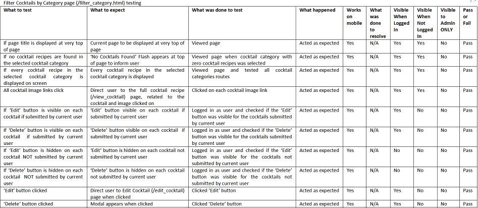
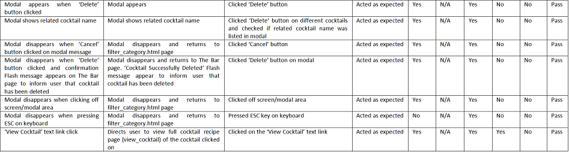

### My Cabinet page (profile.html)
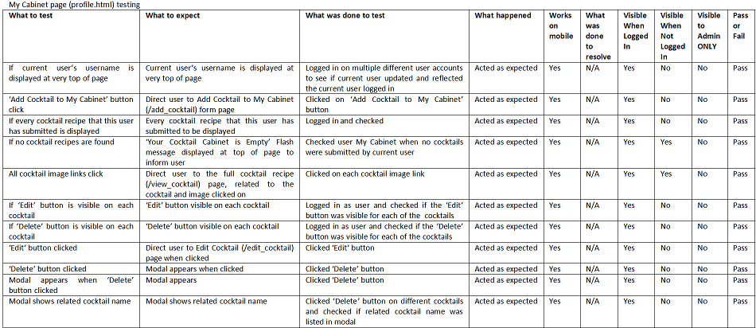
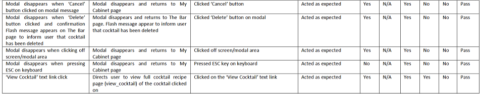

### Add Cocktail (add_cocktail.html)
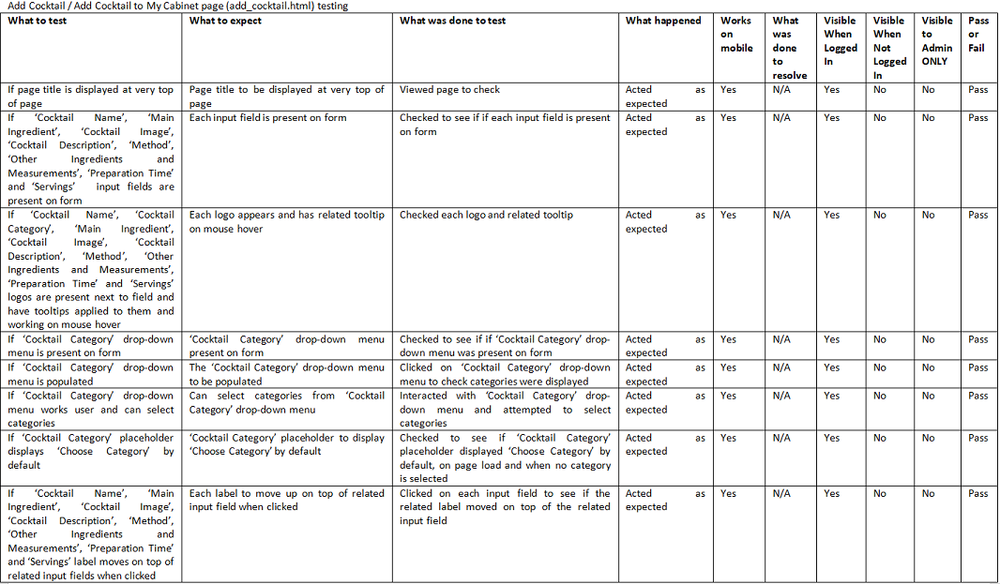
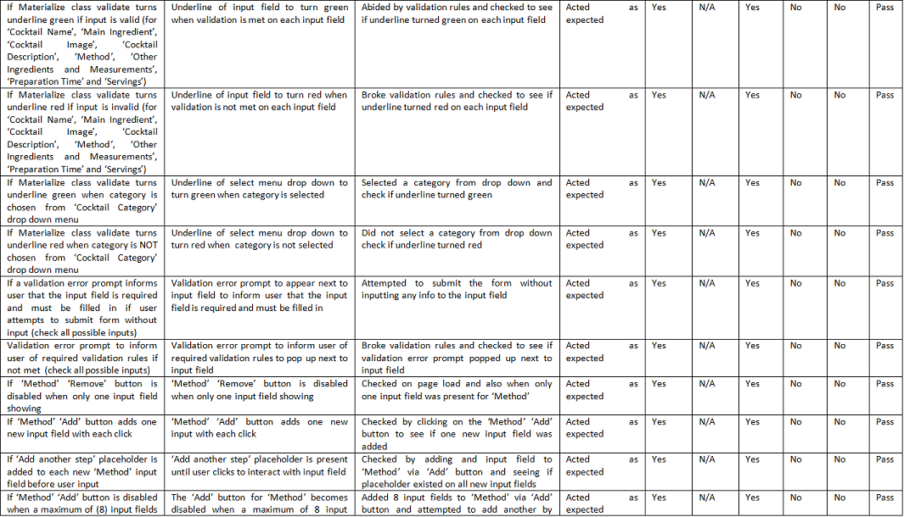
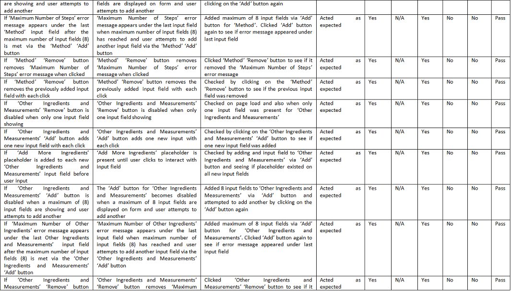
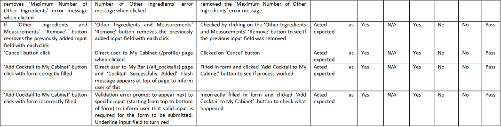

### Edit Cocktail (edit_cocktail.html)
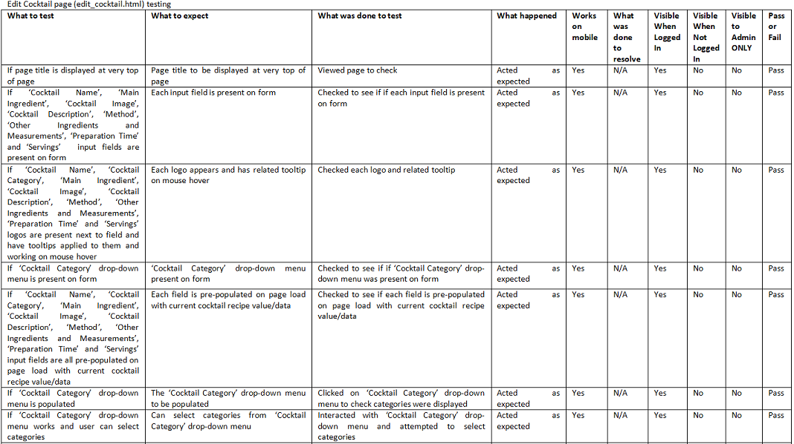
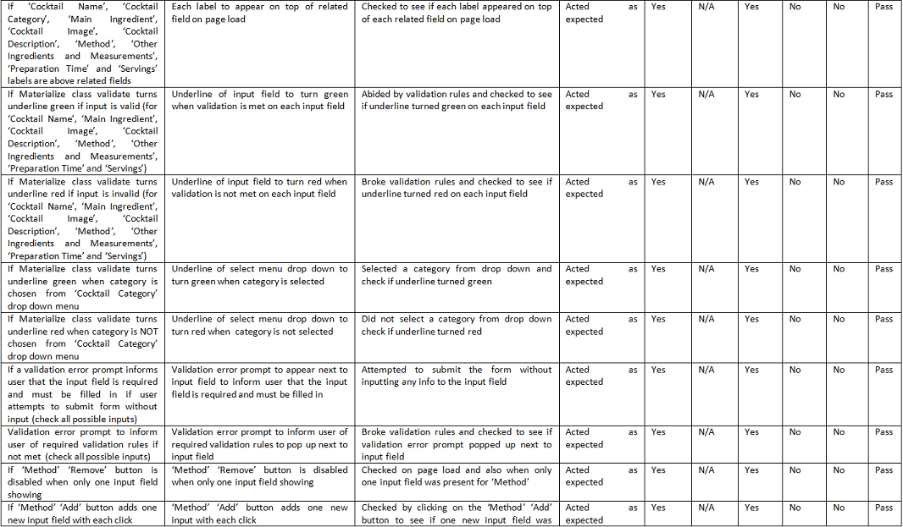
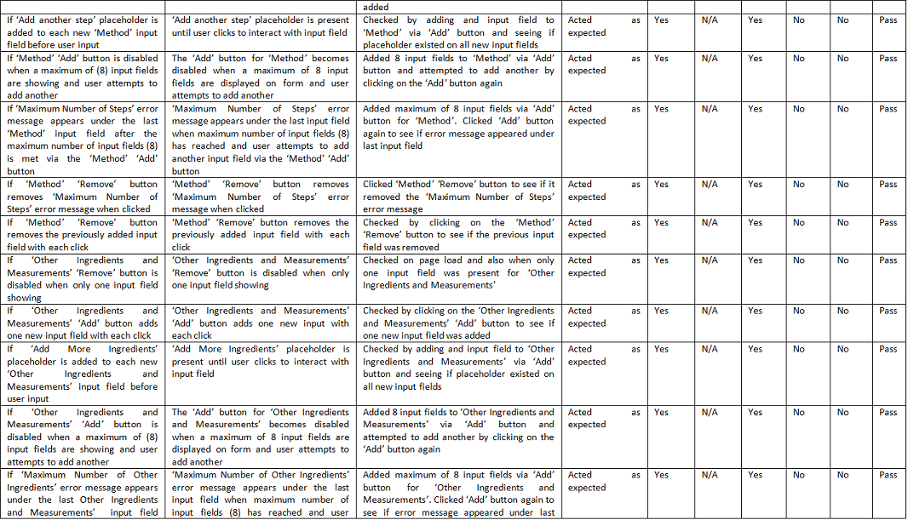
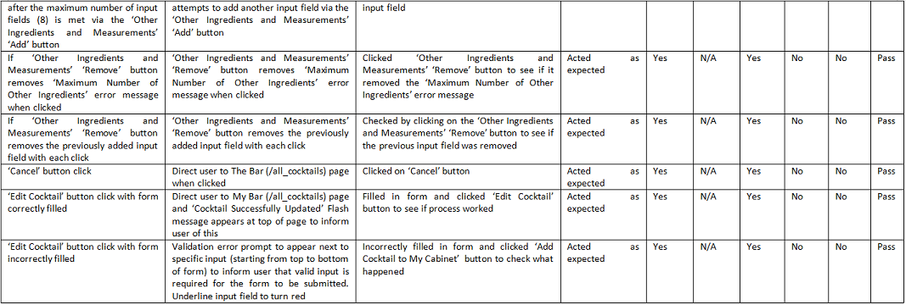

### View Cocktail page (view_cocktail.html)
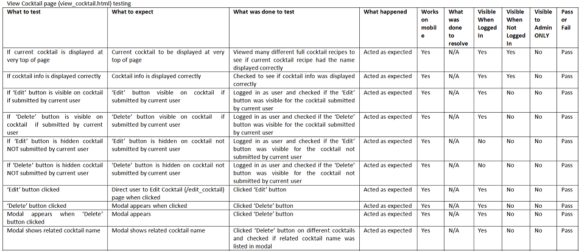
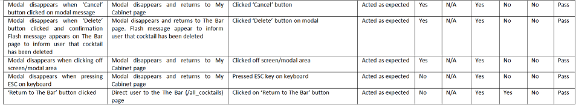

### Manage Categories page (/get_categories)
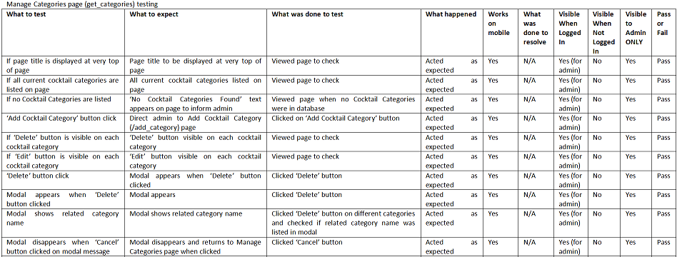
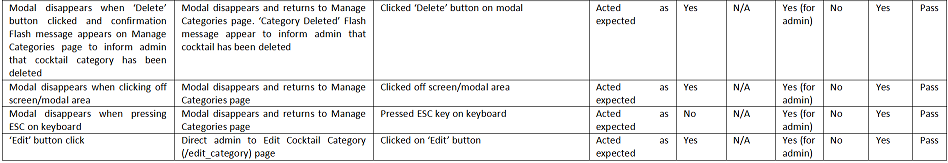

### Add Category page (add_category.html)
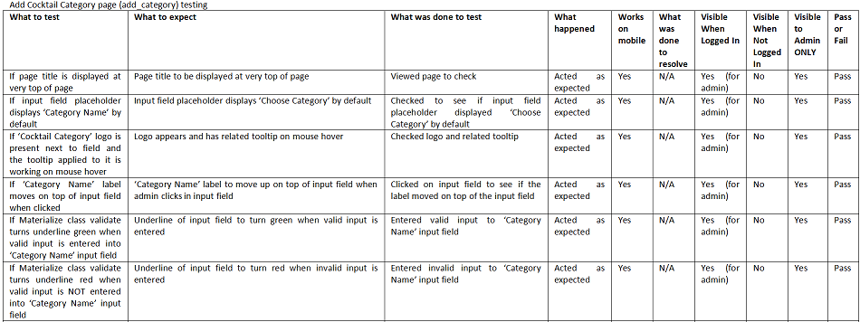
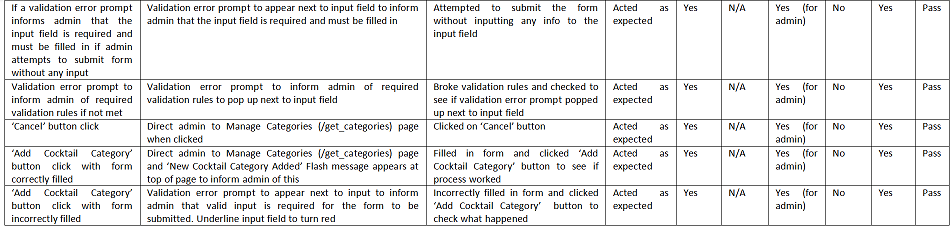

### Edit Category page (edit_category.html)
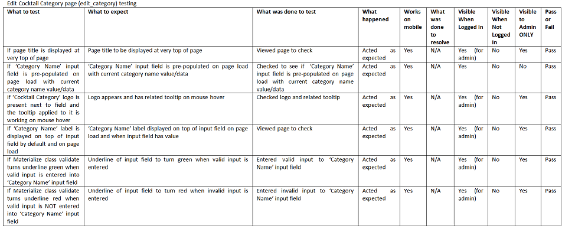
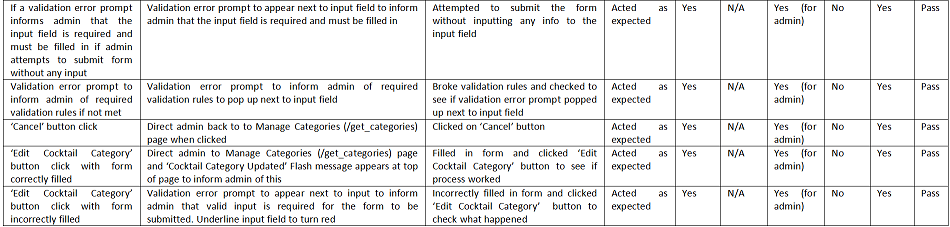

### Log In page (login.html)
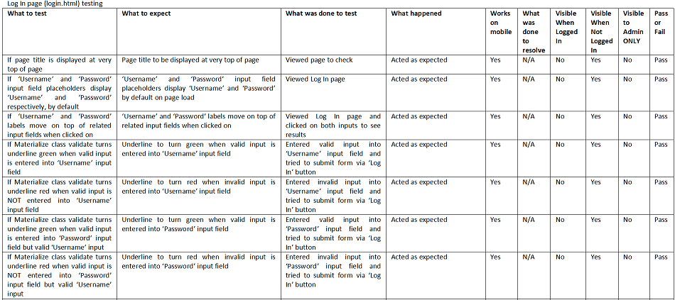
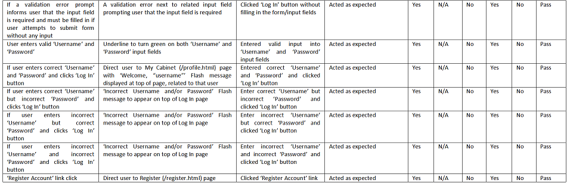

### Register page (register.html)
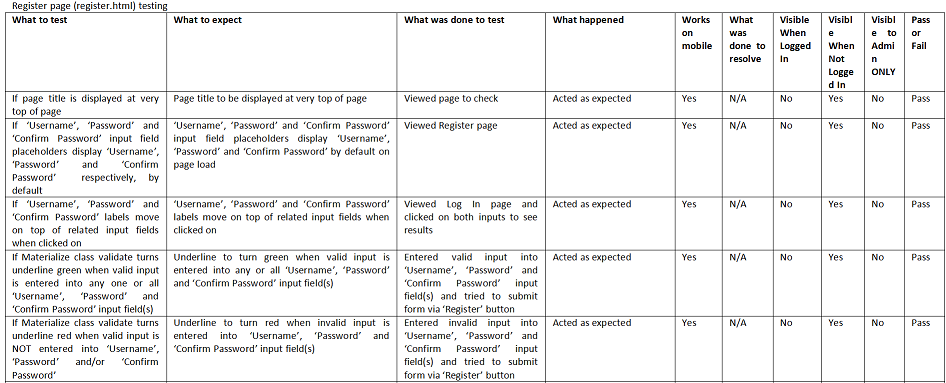
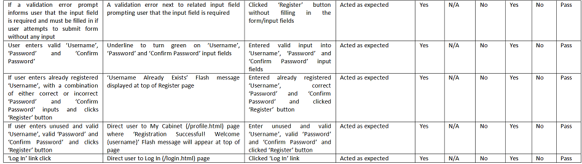

## Interactive Elements
Following is a list of all interactive elements of the The Cocktail Cabinet website.

#### The Cocktail Cabinet website logo
As shown on the images below, the website logo and title is very clear and obvious. The centrepiece, always there and clickable. It serves as a constant reminder to the user about the brand and the website they are visiting. The logo itself is a clickable link (a cursor appears when hovering over), and returns the user back to the home page at any time. 


```
<a href="{{ url_for('home') }}" class="brand-logo">The Cocktail Cabinet</a>
```


## Testing

The W3C Markup Validator, W3C CSS Validator and JSHint tools were used to validate every page of the project to ensure there were no syntax errors in the project. If any were found during development, they were addressed.

-   [W3C Markup Validator](https://validator.w3.org/#validate_by_input)

HTML validation was tested on all pages of the website. Due to the Jinja2 templating, the source code was taken from the live website. This was done by right-clicking and selecting 'View Page Source' (on Google Chrome, Windows). All page results are as follows:

base.html

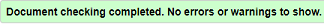

home.html


filter_category.hml


view_cocktail.hml


all_cocktails.html


profile.html


add_cocktail.html


edit_cocktail.html

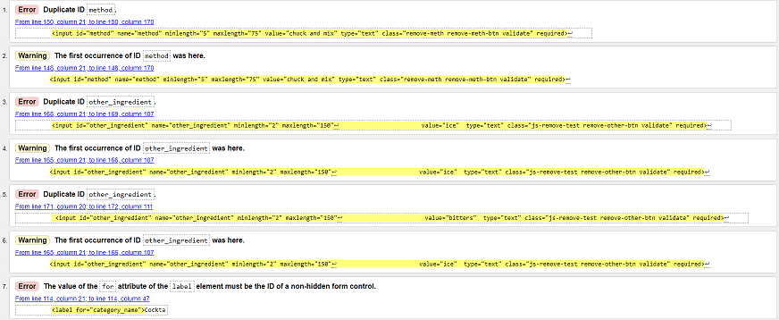

The following errors occurred due to an oversight during the develoment period. Each addition of an input created a duplicated ID along with it.


categories.html


add_category.html


edit_category.html


login.html


register.html


404.html


-   [W3C CSS Validator](https://jigsaw.w3.org/css-validator/#validate_by_input)

style.css

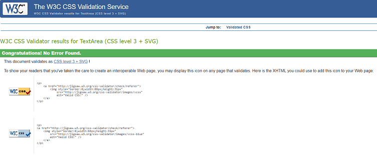

W3C CSS Validator returned no errors. 

-   [JSHint](https://jshint.com/) 

script.js

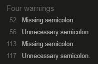

- JSHint returned these warnings prior to creating the forms.js file in response to a console issue found here ()[]. They were addressed and cleared once ran through JSHint again.

script.js - no errors found

forms.js - no errors found

## Testing Original User Stories

Following are the original [User Stories](#user-stories) set out in the early design stages of the project. They were individually tested to see if each goal was satisfied against the completed project.

#### As a New User :
* I want to to be able to access and view the website on the device I'm using.
    - The quiz has been tested for ease of access and responsiveness on dozens of devices (handheld devices such as mobile phones and tablets, laptops, desktop computers and larger Samsung TVs) and is fully responsible from at least a minimum of 320px up to at least 1200px. See [here](#further-testing) for more testing related tasks.
* I want to to be able to navigate the website with ease..
    - Part of the biggest draw to quiz by nature is their simplicity and easy of use. The quiz is a click-and-play format and the interactive prompts and layout make it very clear to understand for any first-time user.
* I want to to be able to understand the website immediately.
    - The style and layout, along with the interactive features and prompts enable first-time users to understand the quiz, the theme and it's purpose.
* I want to to be able to view guidence or some form of help if needs be.
    - The How to Play [button](#how-to-play) is clear and obvious from the first screen the user is presented with. A minimal styling setup and only 4 buttons ensure that information is displayed clearly and to not overwhelm users. All instructions are found after clicking on this button.
* I want to to be able to contact the website developers if I wish to.
    - The Contact [button](#contact) is clear and obvious from the first screen the user is presented with. A minimal styling setup and only 4 buttons ensure that information is displayed clearly and to not overwhelm users. All contact information is found after clicking on this button.
* I want a reason to return.
    - The ability for the user to view cocktail the entire libraby of cocktail recipes is a reason to return. The option to register and share their own is another. The very likely possibility for new recipes to be added by other users is too.

#### As a Returning User :
* I want to find information about the developer's background, their story and growth.
    - The social media links found on the footer [footer](#footer) of every page provides links to all of the developers social media [links](#contact) (instagram, facebook, twitter, tikitok and LinkedIn). The contact information can be found on those platforms. For example the developers contact information is on each profile of these social media websites e.g. there tikitoks of the developing stage, snippets of inside-info on instagram stories and all professional history and access via LinkedIn.
* I want to find the best way to get in contact with the company with any questions I may have.
    - The contact information can be found on the social media platforms, linked in the footer of each page. They provide a quick and direct link to the website's developer.
* I want to be able to contact the company in many different ways.
    - The footer links gives access to 5 social media options the user can choose to contact the developer through.
* I want to be able to view my own cocktail recipes.
    - Once the High Scores [button](#high-scores) is clicked, it gives access to the high scores list, with a maximum of 5 user names and scores capable of being displayed.
* I want to be able to add my own cocktail recipes.
    - After completing all 10 questions, the quiz displays the [end screen](#the-end-screen) to the user. Here, the user can choose to enter their name in the prompted [input field](#input) and the previously disabled Save [button](#save-button) is made clickable. If clicked, the user name is saved to the High Scores list if it made the top 5 high scores.
* I want to to be able to access and view the website on a range of devices/browsers.
    - The quiz has been tested for ease of access and responsiveness on dozens of devices (handheld devices such as mobile phones and tablets, laptops, desktop computers and larger Samsung TVs) and is fully responsible from at least a minimum of 320px up to at least 1200px. it also works on multiple browsers as stated [here](#further-testing).

## Google Chrome Lighthouse Test

Following are the Google Chrome Lighthouse results for each page.

Changes were made due to the results of the Lighthouse tests. These were predominantley stylistic changes in the style.css file. Readability was improved by adding borders to MaterializeCSS default buttons, altering the disabled buttons to give more depth and clarity and increasing the clarity on the form labels.

home.html

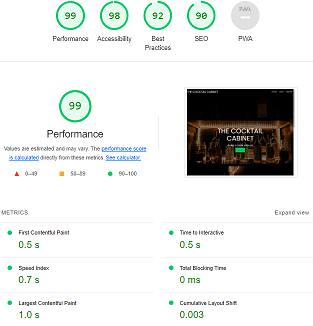

filter_category.hml

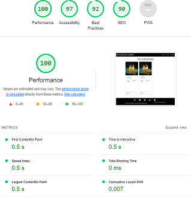

view_cocktail.hml

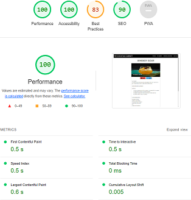

all_cocktails.html


profile.html

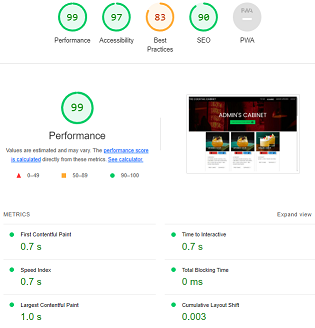

add_cocktail.html

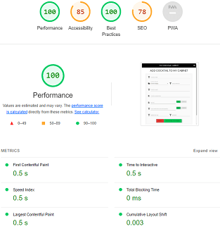

The issue with the nav link was resolved by adding "aria-label" to it.

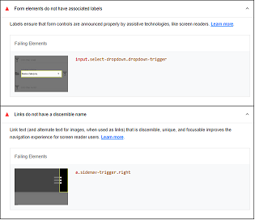
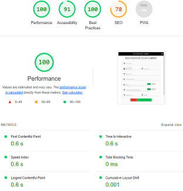

edit_cocktail.html

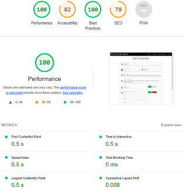

categories.html

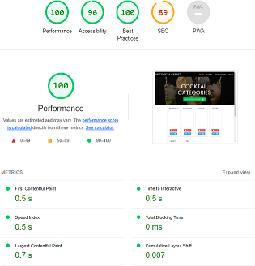

add_category.html

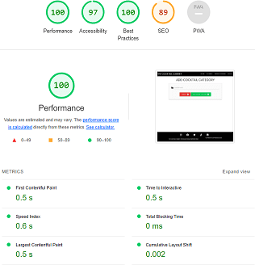

edit_category.html

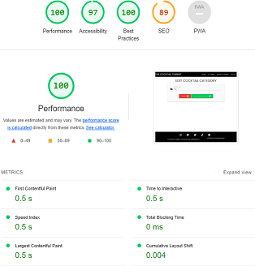

login.html

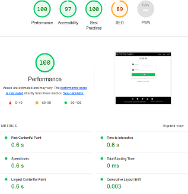

register.html

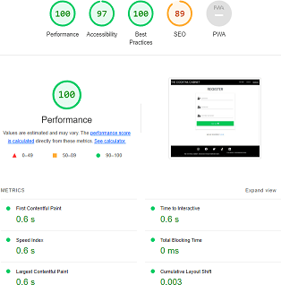

404.html


### Testing Website Flow and Functionality

All of the following tests were repeated multiple times to ensure a fair test. The same tests were then repeated multiple times on different browsers (Google Chrome, Mozilla Firefox, Microsoft Edge and Opera) and then finally the same tests were repeated again on multiple occasions and for different devices (mobile phones, tablets, laptops and larger screen sizes).

#### - Main Menu Test


#### - Quiz Area Test


#### - End Screen Test


### Further Testing

-   Testing was predominantly made using Google Chrome's own developer tools and 'Inspect Mode', although testing was done sporadically on alternative browsers with each major addition to the website e.g new content, style updates and responsive changes via media queries.
-   The browser console was used for error finding and print() in code development.
-   All interactive elements of the website were tested. Button functions, clicking, hiding/showing content, user input, links and general flow of the website. Databse CRUD functionality and testing were made in real-time. Bugs were fixed as they arose.
-   The website was tested on Google Chrome, Mozilla Firefox, Microsoft Edge and Opera browsers and ran efficiently on each one. There were slight stylistic differences when testing between browsers, but these were resolved afterwards. See below for an example when testing on the Opera browser:


To resolve this, the background-colour was specified in the style.css file, instead of allowing the browsers default styling/button colours decide. This encouraged further testing and ensuring that all important style factors were specified.
-   The quiz was viewed on a variety of devices such as Desktop, Laptop, iPad & iPhoneX.
-   Feedback from friends and family, testing the quiz with no prior instruction or expectations. Adjustments were made if necessary to satisfy the [User Targets](#as-a-new-user).

### Bug Fixes
Bug fixes were predominantly completed in real-time as soon as any issues arose. This was to ensure the project would continue developing smoothly without serious, unmanageable bugs arising later that could drastically reduce development time or the layout and functioning of the website.
Lighthouse tests also exposed further bugs with readability and image scaling being two main factors in Accessibility and Performance. These were addressed as best as time allowed, but some Known Bugs still remain.


- An error showing through the console on the majority of pages. This error is related to the JS script linked to the Add and Remove buttons found on the add_cocktail.html and edit_cocktail pages:

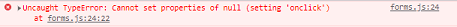

This console error was resolved by creating a new js file (forms.js) and removing the relevant script from the main.js file.
Jinja block scripts templates to insert the forms.js file to the add_cocktail.html and edit_cocktail.html files. Console error cleared after testing and functionality still working as desired.


-   As seen from the style.css file, there is a lot of custom CSS. Media queries were used at different breakpoints - although time consuming, it was vital to invest time into this to ensure the website was functioning correctly on various displays to ensure a major [User Targets](#as-a-new-user) was met.

-   Placed a background-colour behind the score for readability purposes as a Lighthouse test had brought up contrast issues between the gold text colour and the lighter background.

-   Added rel-"noopener" to external links opening in new tabs for security purposes.

### Known Bugs

-   Images not loading can sometimes cause bugs. Attempted to fix with alternative image code.

-   Card layout issues at certain breakpoints when viewing cocktail recipes. Attempted to resolve with adding and increasing min-height.

-   Reset and Search buttons along with the seach input on the all_cocktails.html page becomes cluttered on smaller screens (sub 694px). Attempted flexbox and column changes.

-   Pagination page numbers not centred. Adjusted default MaterializeCSS classes to improve, although not ideal.


## Testing Credits

### Code
- Pagination [setup](https://gist.github.com/mozillazg/69fb40067ae6d80386e10e105e6803c9).

- Dynamically setting active class with Flask and jinja2 [setup](https://stackoverflow.com/questions/55895502/dynamically-setting-active-class-with-flask-and-jinja2/55895621#55895621).


