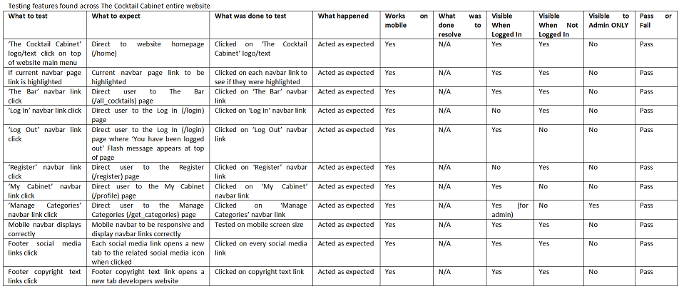
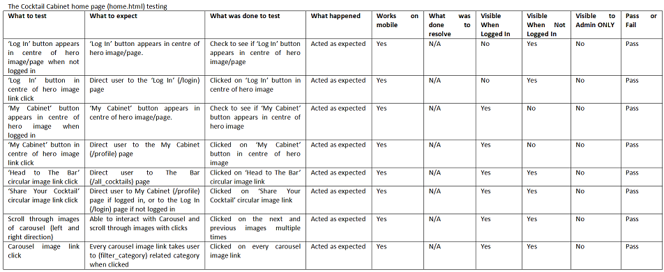
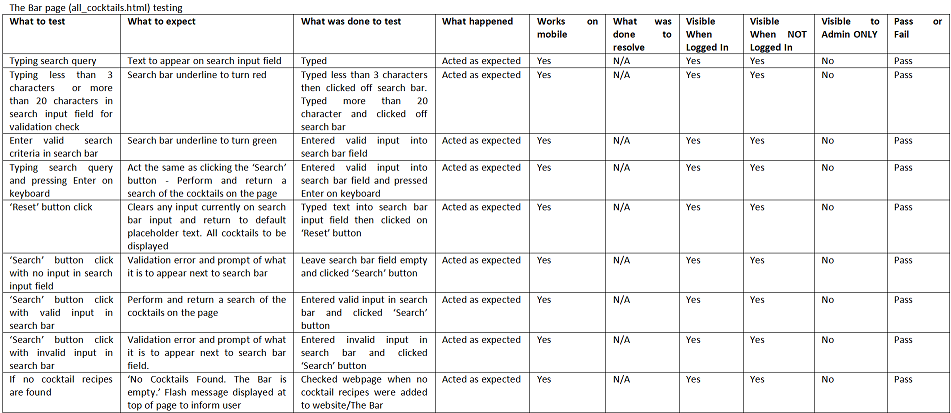
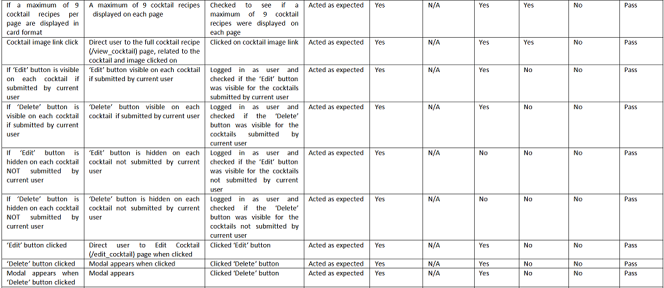
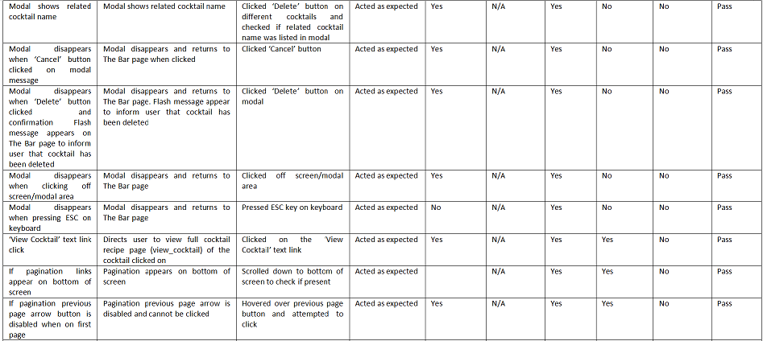
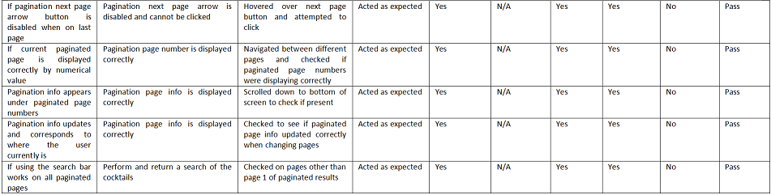

<h1 align="center">The Cocktail Cabinet</h1>

[View the live project here.](https://ms3-final-cocktails.herokuapp.com/)


The Full Testing documentation, following on from the README [found here](README.md)


# Testing Table of Contents
1. [Intro](#example)
2. [Design/Data Schema](#data-schema-design)
3. [Aesthetic Design](#aesthetic-design)
    - [Wireframes](#wireframes)
        - [Desktop](#desktop)
        - [Tablet](#tablet)
        - [Mobile](#mobile)
    - [Colour Palette](#colour-palette)
    - [Images](#images)
    - [Font](#font)
4. [Accessibility](#accessibility)
4. [Features](#features)

4. [Testing](#testing) tidy up and organize all.
4. [Testing Original User Stories](#testing-original-user-stories)
    - [As a New User](#as-a-new-user) this goes to the first one?
    - [As a Returning User](#as-a-returning-user) this goes to the first one?
4. [Credits](#credits)


### Images Testing
- The use of photography is vital in creating allure and desire, especially for this cocktail recipe website. Users are drawn by what they see. The bg.jpg background image is large and provides a fantastic colour to build an interface on. This inspired more imagery to be used for The Bar and My Cabinet especially.

- It's vital for the theme to be clear and obvious. The background image makes the website recognizable and memorable so people recall and return to it, which will draw more eyes to the website. This, along with the CSS styling and colour palette solidifies the theme. The following image was used.


Logo


### Font Testing
-  The The Cocktail Cabinet uses the Poppins font. It provides that clean, clear style without compromising on readability - a vital design feature for any website. This is available for free via [Google Fonts](https://fonts.google.com/) and imported via CSS. Sans Serif is used as a secondary option in case of failure to import the font into the website correctly. Poppins is a clean font used frequently in designs, so it is both attractive and appropriate.

## Accessibility Testing
Extremely important aspect.
-   Semantic design.
-   The use of alt to describe images and other content.
-   Aria-labelledby to link sections.
-   Colour and contrast considerations and testing.
-   Adding labels to forms.
-   Prompts to help guide users.

## Features Testing

There are universal features that are present throughout The Cocktail Cabinet website. These feature are:
- Responsive on all device sizes - from 320px upwards to larger desktops reaching 1200px and more.
- Fully-responsive nav bar, with simple, obvious and clean lines and text.
- The nav bar menu is mobile friendly, adusting automatically at specific breakpoints thanks to Materializecss's easy-to-use framework.
- The Cocktail Cabinet brand logo/name is seen at all times whether tucked to the left, central on reduced screen-sizes or at the top of the mobile menu on smaller and mobile devices. This is vital for brand consistency and serves as a simple way of reminding the user of the website's name. The logo is clickable and always takes the user to The Cocktail Cabinet home page (home.html).
- Clear and obvious navbar links to other pages within the website.
- Fully responsible footer which matches the design and colour palette of the top navbar.
- Social links in footer, linking to creator/website social links and provides ways to contact them.
- Name of website along with copyright info in footer.
- All clickable images, buttons, links etc have a hovering cursor/pointer to signify that that element can be interacted with. The majority of these elements being visually promted either throgh a short zoom in/out animation, colour change or highlighting.
- A Flash text appears at the top of the webpage whenever a user or admin completes a task - by either adding, editing or deleting information. They are informed of this.

Here's a breakdown of all the design features on each of the main webpages within The Cocktail Cabinet website:

### - The Cocktail Cabinet home page (home.html)


The home page for The Cocktail Cabinet website. All visitors will be welcomed by this webpage. The features include:
- The user is met with a 100vh hero image (bg.jpg) of a selection of alcohol bottles on a dark and slightly dimmed background - an obvious theme and impactful. A brief text gives the website's slogan.
- A button to entice the user to 'Log In'. This button changes to 'My Cabinet' if the user is already logged in.
- Underneath the hero image, a few simple suggestions/steps/instructions for users to follow and explore. Some guidence on what to do if new to the site, with the rounded images clickable and related to the text below. Quick links.
- Carousel. A carousel of all cocktail categories avilable on the website. Click leads to (filter_category.html) with all the related cocktails listed.

### - The Bar page (all_cocktails.html)





The Bar. This is where every cocktail recipe on The Cocktail Cabinet website is listed. All visitors to the website can view this webpage. The features include:
- Current/active page is highlighted on the nav bar
- The user is met with a large image (bar.jpg) and the title of the page (The Bar) centered to the image with a brief text description of the pages purpose.
- A search bar is located just under the image, for quick, easy access for user preferred searches. The user can search by name, ingredients, alcohol, as suggested by the placeholder and either use a keyboard ENTER entry, or use the 'Search' button to seatch though the entire websites's database of cocktail recipes.
- Reset button next to the Seach bar, to clear and restart the user's search options.
- A list of every cocktail recipes on the website presented in card format, with purposefully limited but relavant information related to each cocktail recipe.
- Ability to click on each cocktail recipie image to advance to the full recipe page (view_cocktail).
- If the cocktail recipie was submitted by the user, the 'Edit' button under the cocktail recipe image forwards the user to the Edit Cocktail (edit_cocktail.html) page.
- If the cocktail recipie was submitted by the user, the 'Delete' button under the cocktail recipe image allows the user to delete the cocktail recipe. The user is met with a modal that asks for confirmation on wheither they want to delete that cocktail or not. User must click 'Delete' again to confirm this (which will then delete the cocktail recipie from the website and the database), otherwise they can cancel by clicking the 'Cancel' button or by just clicking off screen or pressing ESC on the keyboard and the cocktail recipe will remain on the website. 
- The 'Edit' and 'Delete' buttons are hidden if the user did not submit the cocktail recipe.
- A clickable link at the bottom of each seperate cocktail recipie card to advance to the full recipe page (view_cocktail).
- Pagination. A total of 9 cocktail recipes per page. The number of pages is based on the number of recipes found in the database. The user can select a specific page, or browse the list of recipes by clciking the previous or next buttons on either side of the page numbers.
- Pagination info. A small text area informing the user of the amount of recipes on the current page and the total amount of cocktails in the database.

### - My Cabinet page (profile.html)


My Cabinet. This is where every cocktail recipe the user has submitted is stored. Only rgistered users(and admin) can view this page. The features include:
- Current/active page is highlighted on the nav bar
- The users username presented in large text at the top of the page.
- The 'Add Cocktail to My Cabinet' button under the username, when clicked advances to the 'Add Cocktail to My Cabinet' page.
- A list of the specific users submitted cocktail recipes presented in card format, with purposefully limited but relavant information related to each cocktail recipe.
- The 'Delete' and 'Edit' buttons visible on every cocktail recipie. As previously metioned, these have the same links and path, linked to the chosen cocktail and their data.
- A clickable link at the bottom of each seperate cocktail recipie card to advance to the full recipe page (view_cocktail).

### Add Cocktail (add_cocktail.html)


The Add Cocktail / Add Cocktail to My Cabinet page is for users to add their cocktail recipie to the website via a form. Only registered users(and admin) can use this feature. The cocktail recipie is added to The Bar (all_cocktails.html), the My Cabinet (profile.html) page and to the cocktail's collection (whichever the user selects) that can then be found through either searching The Bar, or by the carousel on the home page which then leads to the (filter_category) page. The features include:
- Placeholders and labels on all inputs serve as helpful guidence for users.
- Validation on all user inputs (see code breakdown again? validate class).
- Several inputs linked to the database (see data schema, code breakdown etc for explanation of inputs, types, data links etc.)
- Cocktail Name - The cocktail name that will be presented for all to see on the recipes image.
- Dropdown select options for user to choose the Cocktail Category their cocktail belongs to. Admin has control over which categories are added to the website/database.
- Main Ingredient - The cocktails main ingredient. Tends to be the most prominent ingredient/alcoholic spirit (but also mocktails accepted).
- Ability for user to add a URL for their cocktail image. This is validated and has some error handling linked to it (see code breakdown, error handling)
-Cocktail Description - A text input to accept the users description of their cocktail.
- Method. A maximum of 8 methods that the user can add. 'Add' a new method or 'Remove' a previous method via the linked buttons. If the user attempts to add more than 8 methods, the user is informed of this via an error message underneath the last input field. The Add and Remove buttons are disabled (via the materializecss class="disabled") if there's no need for them to be used.
- Other Ingredients and Measurments. Just like the the Method input, a maximum of 8 other ingredients can be added by the user. The user can add or remove a previous other ingredient via the linked buttons during the form filling. If the user attempts to add more than 8, the user is informed of this via an error message underneath the last input field. The Add and Remove buttons are disabled (via the materializecss class="disabled") if there's no need for them to be used.
- Preperation Time - How long it takes to prepare the cocktail.
- Servings. This is set to only accept numerical inputs, and a helpful up/down scroll number can be used instead of manually typing.
- 'Add Cocktail Button to My Cabinet'. This button submits the form to the mongodb database if all inputs are valid and met.
- 'Cancel' button. Leaves the page and returns to the users My Cabinet.

### Edit Cocktail (edit_cocktail.html)


The Edit Cocktail page is for users to edit their own cocktail recipie via a form. Only registered users(and admin) can use this feature. The cocktail edited cocktail recipie is updated when the form is submitted and found in the same places as the original recipie. The information expected from the user is the same as the add_cocktail.html page. The features include:
- Labels on all inputs with the current cocktail related data/value on each input.
- Validation on all user inputs (see code breakdown again? validate class).
- 'Edit Button'. This button submits the form to the mongodb database if all inputs are valid and met and updates that specific cocktail recipie.
- 'Cancel' button. Leaves the page and returns to The Bar page.

### - View Cocktail page (view_cocktail.html)


The View Cocktail page is where the visitor can see the full recipie for the cocktail they selected. All visitors to the website can view this webpage. The features include:
- Cocktail Name in large above the recipie.
- All data/cocktail information presented.
- A large image of the cocktail.
- 'Edit' and 'Delete' buttons if the cocktail recipie was submitted by the user (Edit and Delete buttons work the same as the others on the website).
- 'Return to The Bar' button, which redirects the user to The Bar page.

### - Manage Categories page (/get_categories)


The Manage Categories page is where admin can view all the cocktail categories available. Only the website's admin can view this webpage. The features include:
- All cocktail categories information presented in a list.
- 'Add Cocktail Category' button. When clicked, it goes to the Add Cocktail Category (add_category.html) form page.
- 'Delete' button when clicked will show the modal, just like other delete featues. The admin chooses from Delete to confirm or Cancel to return to the exit the modal.
- 'Edit' button when clicked will forward the admin to the Edit Cocktail Category (edit_category.html) form page.

### - Add Category page (add_category.html)


The Add Cocktail Category page is where the admin can add new cocktail categories to the website. These categories will then be avaiable to choose from the cocktail forms via dropdown (see add_cocktail.html and edit_cocktail.html). Again, only the admin can view this page. The features include:
- Page title in large at top of the page.
- Category Name placeholder and label on input.
- 'Cancel' button. When clicked, leaves the page and returns to the Manage Categories page.
- 'Add Cocktail Category' button. When clicked, submits the form and returns to the Manage Categories page, where the newly created category is added to the list.

### - Edit Category page (edit_category.html)


The Edit Cocktail Category page is where the admin can edit a current cocktail category. These categories will then be updated in the database and shown via the dropdown select options (see add_cocktail.html and edit_cocktail.html). Again, only the admin can view this page. The features include:
- Page title in large at top of the page.
- Category Name label  and current value in input.
- 'Cancel' button. When clicked, leaves the page and returns to the Manage Categories page.
- 'Edit Cocktail Category' button. When clicked, submits the form and returns to the Manage Categories page, where the edit category is updated on the list.

### - Log In page (login.html)


The Log In page is where visitors can enter their details and log in to their account. All visitors to the website can view this webpage. The features include:
- 'Log In' title on top of the page.
- Username input with placeholder and validation applied.
- Password input with placeholder and validation applied.
- 'Log In' button. When clicked, the user is forwarded to their personal My Cabinet (profile.html) page.

### - Register page (register.html)


The Register page is where visitors can enter their details for the first time to register their new account. All visitors to the website can view this webpage. The features include:
- 'Register' title on top of the page.
- Username input with placeholder and validation applied.
- Password input with placeholder and validation applied.
- 'Register' button. When clicked, the user is forwarded to their personal My Cabinet (profile.html) page.


## Interactive Elements
Following is a list of all interactive elements of the The Cocktail Cabinet website.

#### The Cocktail Cabinet website logo
As shown on the images below, the website logo and title is very clear and obvious. The centrepiece, always there and clickable. It serves as a constant reminder to the user about the brand and the website they are visiting. The logo itself is a clickable link (a cursor appears when hovering over), and returns the user back to the home page at any time. 


```
<a href="{{ url_for('home') }}" class="brand-logo">The Cocktail Cabinet</a>
```

#### Toggle Menu Elements

Listed are the main features of the main menu of the quiz. The user simply clicks to show or hide the buttons to display info or return back to the main menu.

#### - How to Play


```javascript
howToButton.onclick = function () {
    if (howToDiv.style.display !== "block") {
        howToDiv.style.display = "block";
        startButton.classList.add('hide');
        contactButton.classList.add('hide');
        highscoresButton.classList.add('hide');
    } else {
        howToDiv.style.display = "none";
        startButton.classList.remove('hide');
        contactButton.classList.remove('hide');
        highscoresButton.classList.remove('hide');
    }
};
```

#### - Contact

Each icon for the social media links turn gold when the user hovers over them to highlight the focused icon.


```javascript
contactButton.onclick = function () {
    if (contactDiv.style.display !== "block") {
        contactDiv.style.display = "block";
        startButton.classList.add('hide');
        howToButton.classList.add('hide');
        highscoresButton.classList.add('hide');
    } else {
        contactDiv.style.display = "none";
        startButton.classList.remove('hide');
        howToButton.classList.remove('hide');
        highscoresButton.classList.remove('hide');
    }
};
```

The social media links on smaller screens (below 481px - such as mobile phones) have a more mobile-friendly layout.


#### - High Scores


````javascript
highscoresButton.onclick = function () {
    if (highscoresDiv.style.display !== "block") {
        highscoresDiv.style.display = "block";
        startButton.classList.add('hide');
        howToButton.classList.add('hide');
        contactButton.classList.add('hide');
    } else {
        highscoresDiv.style.display = "none";
        startButton.classList.remove('hide');
        howToButton.classList.remove('hide');
        contactButton.classList.remove('hide');
    }
};
````

#### Buttons

#### - General Buttons
- Almost every button is styled to look the same. A clean and clear button to make for user readability.


- The colours simply invert when a cursor hovers over them. A simple visual indicator and keeping in line with the colour palette.


#### - Delete Button
- Due to the nature of this button and it's significance, it was decided to style this differently with a golden (#) hue/ . This is pure bragging rights and to entice the players to compete for the highest score. it will be big factor for returning players.


#### - Edit Button
- The Save button is set as disabled as a default. Once the user inputs their name, the button returns to a normal state, just like the others.


#### - Cancel Button

- Gold (rgb(255,210,0)) indicates a correct answer.


#### - Input

- The 'Enter your name' input field has a very basic style applied. IF the user chooses not to enter their name, then the Save button remains disabled and the user will not be able to save their score to the High Scores section.


## Testing

The W3C Markup Validator, W3C CSS Validator and JSHint tools were used to validate every page of the project to ensure there were no syntax errors in the project. If any were found during development, they were addressed.

-   [W3C Markup Validator](https://validator.w3.org/#validate_by_input)

index.html


end.html


-   [W3C CSS Validator](https://jigsaw.w3.org/css-validator/#validate_by_input)

style.css


-   The Warnings(1), also seen on the above screenshot, references the Google imported style sheet, and that it won't check that.


-   [JSHint](https://jshint.com/) 

main.js


end.js


## Testing Original User Stories

Following are the original [User Stories](#user-stories) set out in the early design stages of the project. They were individually tested to see if each goal was satisfied against the completed project.

#### As a New User :
* I want to to be able to access and view the website on the device I'm using.
    - The quiz has been tested for ease of access and responsiveness on dozens of devices (handheld devices such as mobile phones and tablets, laptops, desktop computers and larger Samsung TVs) and is fully responsible from at least a minimum of 320px up to at least 1200px. See [here](#further-testing) for more testing related tasks.
* I want to to be able to navigate the website with ease..
    - Part of the biggest draw to quiz by nature is their simplicity and easy of use. The quiz is a click-and-play format and the interactive prompts and layout make it very clear to understand for any first-time user.
* I want to to be able to understand the website immediately.
    - The style and layout, along with the interactive features and prompts enable first-time users to understand the quiz, the theme and it's purpose.
* I want to to be able to view guidence or some form of help if needs be.
    - The How to Play [button](#how-to-play) is clear and obvious from the first screen the user is presented with. A minimal styling setup and only 4 buttons ensure that information is displayed clearly and to not overwhelm users. All instructions are found after clicking on this button.
* I want to to be able to contact the website developers if I wish to.
    - The Contact [button](#contact) is clear and obvious from the first screen the user is presented with. A minimal styling setup and only 4 buttons ensure that information is displayed clearly and to not overwhelm users. All contact information is found after clicking on this button.
* I want a reason to return.
    - The ability for the user to view cocktail the entire libraby of cocktail recipes is a reason to return. The option to register and share their own is another. The very likely possibility for new recipes to be added by other users is too.

#### As a Returning User :
* I want to find information about the developer's background, their story and growth.
    - The social media links found on the footer [footer](#footer) of every page provides links to all of the developers social media [links](#contact) (instagram, facebook, twitter, tikitok and LinkedIn). The contact information can be found on those platforms. For example the developers contact information is on each profile of these social media websites e.g. there tikitoks of the developing stage, snippets of inside-info on instagram stories and all professional history and access via LinkedIn.
* I want to find the best way to get in contact with the company with any questions I may have.
    - The contact information can be found on the social media platforms, linked in the footer of each page. They provide a quick and direct link to the website's developer.
* I want to be able to contact the company in many different ways.
    - The footer links gives access to 5 social media options the user can choose to contact the developer through.
* I want to be able to view my own cocktail recipes.
    - Once the High Scores [button](#high-scores) is clicked, it gives access to the high scores list, with a maximum of 5 user names and scores capable of being displayed.
* I want to be able to add my own cocktail recipes.
    - After completing all 10 questions, the quiz displays the [end screen](#the-end-screen) to the user. Here, the user can choose to enter their name in the prompted [input field](#input) and the previously disabled Save [button](#save-button) is made clickable. If clicked, the user name is saved to the High Scores list if it made the top 5 high scores.
* I want to to be able to access and view the website on a range of devices/browsers.
    - The quiz has been tested for ease of access and responsiveness on dozens of devices (handheld devices such as mobile phones and tablets, laptops, desktop computers and larger Samsung TVs) and is fully responsible from at least a minimum of 320px up to at least 1200px. it also works on multiple browsers as stated [here](#further-testing).

## Google Chrome Lighthouse Test

Following are the Google Chrome Lighthouse results for each page.

- Main menu and quiz area/ index.html


- End page / end.html


### Testing Website Flow and Functionality

All of the following tests were repeated multiple times to ensure a fair test. The same tests were then repeated multiple times on different browsers (Google Chrome, Mozilla Firefox, Microsoft Edge and Opera) and then finally the same tests were repeated again on multiple occasions and for different devices (mobile phones, tablets, laptops and larger screen sizes).

#### - Main Menu Test


#### - Quiz Area Test


#### - End Screen Test


### Further Testing

-   Testing was predominantly made using Google Chrome's own developer tools and 'Inspect Mode', although testing was done sporadically on alternative browsers with each major addition to the website e.g new content, style updates and responsive changes via media queries.
-   Console.log() function was used for JavaScript code development and print() elsewhere.
-   All interactive elements of the website were tested. Button functions, clicking, hiding/showing content, user input, links and general flow of the website. Databse CRUD functionality and testing were made in real-time. Bugs were fixed as they arose.
-   The website was tested on Google Chrome, Mozilla Firefox, Microsoft Edge and Opera browsers and ran efficiently on each one. There were slight stylistic differences when testing between browsers, but these were resolved afterwards. See below for an example when testing on the Opera browser:


To resolve this, the background-colour was specified in the style.css file, instead of allowing the browsers default styling/button colours decide. This encouraged further testing and ensuring that all important style factors were specified.
-   The quiz was viewed on a variety of devices such as Desktop, Laptop, iPad & iPhoneX.
-   Feedback from friends and family, testing the quiz with no prior instruction or expectations. Adjustments were made if necessary to satisfy the [User Targets](#as-a-new-user).

### Bug Fixes
Bug fixes were predominantly completed in real-time as soon as any issues arose. This was to ensure the project would continue developing smoothly without serious, unmanageable bugs arising later that could drastically reduce development time or the layout and functioning of the website.

-   As seen from the style.css file, there is a lot of custom CSS. Media queries were used at different breakpoints - although time consuming, it was vital to invest time into this to ensure the website was functioning correctly on various displays to ensure a major [User Targets](#as-a-new-user) was met. Some JavaScript tweaks were also implemented to alter the class width at different stages of the website e.g. the main menu, website itself or the end.

-   Placed a background-colour behind the score for readability purposes as a Lighthouse test had brought up contrast issues between the gold text colour and the lighter background.

-   Added rel-"noopener" to external links opening in new tabs for security purposes.

### Known Bugs

-   The background image (maps.jpg) repeats slightly towards the very bottom of the Surface Pro 7 (912px x 1368px) device. It can also do this on larger TVs or wide-display devices such as tablets.


## Credits

### Code
-   At the early stages of the development, the [How to Make a Quiz App using HTML CSS Javascript - Vanilla Javascript Project for Beginners Tutorial](https://www.youtube.com/watch?v=f4fB9Xg2JEY&list=FLoLMoJL7IfiYl8F3sN_CEqQ&index=16) tutorial was followed and the code was used as the basis of the quiz. Supporting GitHub code [here](https://github.com/briancodex/quiz-app-js). Original code was later added alongside that found in the YouTube video to suit the quiz. Code tweaks were made to suit this quiz, pre-determined code edited or removed along with adjustments and restyling to the majority of the CSS found in the credited video. Upon further searching, it seems that [Build a Quiz App - Intro](https://www.youtube.com/watch?v=u98ROZjBWy8&list=PLDlWc9AfQBfZIkdVaOQXi1tizJeNJipEx) and that playlist of videos may be what that YouTube video was also inspired by.

-   'Web Dev Simplified' YouTube [video](https://www.youtube.com/watch?v=riDzcEQbX6k&list=FLoLMoJL7IfiYl8F3sN_CEqQ&index=13) was also used and combined with the above videos to help shape the The Cocktail Cabinet. Supporting GitHub code [here](https://github.com/WebDevSimplified/JavaScript-Quiz-App).

-   The API aspect of the quiz was introduced thanks to the [Build a Quiz App (11) - Fetch API to Load Questions API](https://www.youtube.com/watch?v=3aKOQn2NPFs&list=PLDlWc9AfQBfZIkdVaOQXi1tizJeNJipEx&index=12) tutorial, to which edits were then made. Supporting link to GitHub [here](https://github.com/jamesqquick/Build-A-Quiz-App-With-HTML-CSS-and-JavaScript).

-   The ability to toggle (show and hide) content via the How To Play, Contact and High Scores buttons on the main menu screen came from W3Schools documentation found [here](https://www.w3schools.com/howto/howto_js_toggle_hide_show.asp), and a separate source [here](https://sebhastian.com/javascript-show-hide-div-onclick-toggle/) which was then edited to suit the project, along with additional customization.

-   This README.md document was based on Code Institutes [SampleREADME](https://github.com/Code-Institute-Solutions/SampleREADME/blob/master/README.md). The template was used as a guide, then filled with content related to this website. The MS2 Quiz [README.md](https://github.com/rhysmoggs/ms2-quiz/blob/main/README.md) file - the developers personal MS2 submission for the Code Institute course - was also used and then edited to suit this project.

- Pagination [setup](https://gist.github.com/mozillazg/69fb40067ae6d80386e10e105e6803c9).

- Dynamically setting active class with Flask and jinja2 [setup](https://stackoverflow.com/questions/55895502/dynamically-setting-active-class-with-flask-and-jinja2/55895621#55895621).


