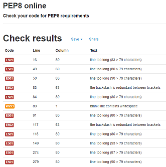
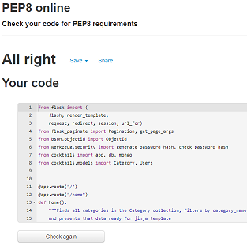
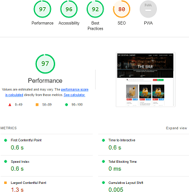

<h1 align="center">The Cocktail Cabinet</h1>

[View the live project here.](https://ms3-final-cocktails.herokuapp.com/)


The Full Testing documentation, following on from the README [found here](README.md)


# Testing Table of Contents
1. [Intro](#intro)

4. [Validation](#validation)
4. [Lighthouse](#lighthouse)
2. [Data Testing](#data-schema-design)
4. [Features Testing](#features-testing)

4. [Testing Original User Stories](#testing-original-user-stories)
    - [As a New User](#as-a-new-user)
    - [As a Returning User](#as-a-returning-user)
    - [As an Admin](#as-an-admin)
4. [Testing Credits](#testing-credits)
    - [Reading and Guidence](#reading-and-guidence)
    - [Code](#code)


### User-Related Image Testing
- The website uses the following code to overcome errors if images are failed to load:
```
onerror="this.onerror=null;this.src='static/images/whiskey-sour.jpg';"
```
The use of Jinja attempts to overcome some possible errors for the 'cocktail_image' data. Due to the nature of how the images are given and presented, alternative measures were put in place to try and handle different outcomes (along with the form validation found when initially filling the 'cocktail_image' input on the Add Cocktail and Edit Cocktail pages). Overall, the combination looks like this:
```

    

    

```

## Features Testing

### There are universal features that are present throughout The Cocktail Cabinet website. These are tested here:


### Here's a breakdown of all the design features on each of the main webpages within The Cocktail Cabinet website:

### The Cocktail Cabinet home page (home.html)


### The Bar page (all_cocktails.html)


### Filter Cocktails by Category (filter_category.html)


### My Cabinet page (profile.html)


### Add Cocktail (add_cocktail.html)


### Edit Cocktail (edit_cocktail.html)


### View Cocktail page (view_cocktail.html)


### Manage Categories page (/get_categories)


### Add Category page (add_category.html)


### Edit Category page (edit_category.html)


### Log In page (login.html)


### Register page (register.html)


## Validation Testing

The W3C Markup Validator, W3C CSS Validator and JSHint tools were used to validate every page of the project to ensure there were no syntax errors in the project. If any were found during development, they were addressed.

-   [W3C Markup Validator](https://validator.w3.org/#validate_by_input)

HTML validation was tested on all pages of the website. Due to the Jinja2 templating, the source code was taken from the live website. This was done by right-clicking and selecting 'View Page Source' (on Google Chrome, Windows). All page results are as follows:

base.html


home.html


filter_category.hml


view_cocktail.hml


all_cocktails.html


profile.html


add_cocktail.html


edit_cocktail.html


The following errors occurred on both the add_cocktail.html and edit_cocktail.html pages. These were due to an oversight during the develoment period. Each addition of an input also created a duplicated id.
This was resolved on the add_cocktail.html page with some guidence from mentor Antonio Rodriguez by creating a counter for an id element, and then attaching that counter to a prefixed id, giving an unique number, and thus id to each input. The edit_cocktails.html errors remain.

categories.html


add_category.html


edit_category.html


login.html


register.html


404.html


-   [W3C CSS Validator](https://jigsaw.w3.org/css-validator/#validate_by_input)

style.css


W3C CSS Validator returned no errors. 

-   [JSHint](https://jshint.com/) 

script.js


- JSHint returned these warnings prior to creating the forms.js file in response to a console issue found here ()[]. They were addressed and cleared once ran through JSHint again.

script.js - no errors found

forms.js - no errors found

-   [PEP8](http://pep8online.com/)

The following errors occurred:



These issues were addressed:



## Testing Original User Stories

Following are the original User Stories set out in the early design stages of the project found on the [README](README.md) page. They were individually tested to see if each goal was satisfied against the completed project.

#### As a New User :
* 001 - I want to to be able to access and view the website on the device I'm using.
    - The quiz has been tested for ease of access and responsiveness on dozens of devices (handheld devices such as mobile phones and tablets, laptops, desktop computers and larger Samsung TVs) and is fully responsible from at least a minimum of 320px up to at least 1200px.
* 002 - I want to to be able to navigate the website with ease.
    - Part of the biggest draw to The Cocktail Cabinet is having so many cocktail recipes in one place. This, along with the cocktail recipes simplicity and the interactive prompts and layout make it very clear to understand for any first-time user.
* 003 - I want to to be able to understand the website immediately.
    - The style and layout, along with the interactive features and prompts enable first-time users to understand the website, the theme and it's purpose.
* 004 - I want to to be able to view guidence or some form of help if needs be.
    - The home page has a simple guide on how to interact with the website. Head to The Bar, Add a Cocktail or Share a Cocktail all provide clear instructions and links to users. Visual prompts, large text and page detail (e.g. The Bar), tooltips, labels and other design feature all provide a clear and helpful guide for all users to the website.
* 005 - I want to to be able to contact the website developers if I wish to.
    - The Footer social links are clear and obvious from every page. A minimal styling setup and ensures that the links displayed clearly and to not overwhelm users. All contact information is found after clicking on thiese logos.
* 006 - I want a reason to return.
    - The ability for the user to view cocktail the entire libraby of cocktail recipes is a reason to return. The option to register and share their own is another. The very likely possibility for new recipes to be added by other users is too.

#### As a Returning User :
* 007 - I want to find information about the company's background, their story and growth.
    - The social media links found on the footer of every page provides links to all of the developers social media (instagram, facebook, twitter, tikitok and LinkedIn). The contact information can be found on those platforms. For example the developers contact information is on each profile of these social media websites e.g. there tikitoks of the developing stage, snippets of inside-info on instagram stories and all professional history and access via LinkedIn.
* 008 - I want to find the best way to get in contact with the company with any questions I may have.
    - The contact information can be found on the social media platforms, linked in the footer of each page. They provide a quick and direct link to the website's developer.
* 009 - I want to be able to contact the company in many different ways.
    - The footer links gives access to 5 social media options the user can choose to contact the developer through.
* 010 - I want to be able to view my own cocktail recipes.
    - Once registered and logged in, the user can view all of their own recipes at the My Cabinet page. They will also be added to The Bar page along with ALL user recipes. They'll be automatically added to the Filter Cocktail Category page and will also be avaiable to view in full via the View Cocktail page.
* 011 - I want to be able to add my own cocktail recipes.
    - Once registered and logged in, the user can add their own cocktail recipes at the My Cabinet page by clicking the green Add Cocktail to My Cabinet button and filling in the form.
* 012 - I want to be able to edit my own cocktail recipes.
    - Once registered and logged in, the user can edit all of their own recipes at the My Cabinet page, or any part of the website where cocktail recipes are displayed (The Bar, Filter Cocktail Category, View Cocktail).
* 013 - I want to be able to delete my own cocktail recipes.
    - Once registered and logged in, the user can add their own cocktail recipes at the My Cabinet page by clicking the red delete button next to their specific cocktail. They are able to do this on any part of the website where cocktail recipes are displayed, and are their own (The Bar, Filter Cocktail Category, View Cocktail).
* 014 - I want to to be able to access and view the website on a range of devices/browsers.
    - The quiz has been tested for ease of access and responsiveness on dozens of devices (handheld devices such as mobile phones and tablets, laptops, desktop computers and larger Samsung TVs) and is fully responsible from at least a minimum of 320px up to at least 1200px.

#### As an Admin:
* 015 - I want to have more control than any other user.
    - The admin has all the rights and features avaiable to a standard registered user. On top pf this, the admin has access to the Manage Categories page where admin has solo rights to CRUD functionality and what is displayed on The Cocktail Cabinet webpage.
    - This is achieved through the following code attached to every related function in the routes.py file:
    ```
    session["user"] != "admin":
    ```
    or
    ```
    session["user"] == "admin":
    ```
    - If these are not met, then a Flash message informs the current user/visitor of the reasons:
    ``
    flash("You must be admin to manage cocktail categories!")
    ``
* 016 - I want to be able to view more data than other users.
    - This is acheived through the ```get_categories``` function with:
    ```
    categories = list(Category.query.order_by(Category.category_name).all())
    ```
    - The admin can view more data via the Manage Categories page. All current cocktail categories will be displayed here.
    - This is again achieved by the ```session["user"]``` code, along with allowing only the admin to see the Manage Cateogies navbar link:
    ```
    
        <li><a href="{{ url_for('get_categories') }}">Manage Categories</a></li>
    
    ```
* 017 - I want to be able to add data to the website.
    - The admin can add cocktail categories via the Add Cocktail Category button found on the Manage Categories page.
    - This is acheived through the ```add_category``` function with:
    ```
    category = Category(category_name=request.form.get("category_name"))
    db.session.add(category)
    db.session.commit()
    ```
* 018 - I want to be able to edit data from the website.
    - The admin can edit cocktail categories via the blue edit buttons linked to each individual category found on the Manage Categories page.
    ```
    <a href="{{ url_for('edit_category', category_id=category.id) }}" class="btn-small blue lighten-1">Edit <i class="fas fa-edit right"></i></a>
    ```
    - The button triggers the ```edit_category``` function (found in the routes.py file) and pulls the current category_id found in the page url during session. 
* 019 - I want to be able to delete data from the website.
    - The admin can delete cocktail categories via the red delete buttons linked to each individual category found on the Manage Categories page:
    ```
    <a href="{{ url_for('delete_category', category_id=category.id) }}" class="modal-close btn-small red darken-1 text-shadow">Delete</a>
    ```
    - This Delete button triggers the ```delete_category``` function (found in the routes.py file) and pulls the current category_id found in the page url during session.

## Google Chrome Lighthouse Test

Following are the Google Chrome Lighthouse results for each page.

Changes were made due to the results of the Lighthouse tests. These were predominantley stylistic changes in the style.css file. Readability was improved by adding borders to MaterializeCSS default buttons, altering the disabled buttons to give more depth and clarity and increasing the clarity on the form labels.

home.html


filter_category.hml


view_cocktail.hml


all_cocktails.html



profile.html


add_cocktail.html


The issue with the nav link was resolved by adding "aria-label" to it.


edit_cocktail.html


categories.html


add_category.html


edit_category.html


login.html


register.html


### Testing Website Flow and Functionality

All of the following tests were repeated multiple times to ensure a fair test. The same tests were then repeated multiple times on different browsers (Google Chrome, Mozilla Firefox, Microsoft Edge and Opera) and then finally the same tests were repeated again on multiple occasions and for different devices (mobile phones, tablets, laptops and larger screen sizes).

#### - Main Menu Test


#### - Quiz Area Test


#### - End Screen Test


### Further Testing

-   Testing was predominantly made using Google Chrome's own developer tools and 'Inspect Mode', although testing was done sporadically on alternative browsers with each major addition to the website e.g new content, style updates and responsive changes via media queries.
-   The browser console was used for error finding and print() in code development.
-   All interactive elements of the website were tested. Button functions, clicking, hiding/showing content, user input, links and general flow of the website. Databse CRUD functionality and testing were made in real-time. Bugs were fixed as they arose.
-   The website was tested on Google Chrome, Mozilla Firefox, Microsoft Edge and Opera browsers and ran efficiently on each one. There were slight stylistic differences when testing between browsers, but these were resolved afterwards. See below for an example when testing on the Opera browser:


To resolve this, the background-colour was specified in the style.css file, instead of allowing the browsers default styling/button colours decide. This encouraged further testing and ensuring that all important style factors were specified.
-   The quiz was viewed on a variety of devices such as Desktop, Laptop, iPad & iPhoneX.
-   Feedback from friends and family, testing the quiz with no prior instruction or expectations. Adjustments were made if necessary to satisfy the [User Targets](#as-a-new-user).

### Bug Fixes
Bug fixes were predominantly completed in real-time as soon as any issues arose. This was to ensure the project would continue developing smoothly without serious, unmanageable bugs arising later that could drastically reduce development time or the layout and functioning of the website.
Lighthouse tests also exposed further bugs with readability and image scaling being two main factors in Accessibility and Performance. These were addressed as best as time allowed, but some Known Bugs still remain.

- An error showing through the console on the majority of pages. This error is related to the JS script linked to the Add and Remove buttons found on the add_cocktail.html and edit_cocktail pages:


This console error was resolved by creating a new js file (forms.js) and removing the relevant script from the main.js file.
Jinja block scripts templates to insert the forms.js file to the add_cocktail.html and edit_cocktail.html files. Console error cleared after testing and functionality still working as desired.

-   As seen from the style.css file, there is a lot of custom CSS. Media queries were used at different breakpoints - although time consuming, it was vital to invest time into this to ensure the website was functioning correctly on various displays to ensure a major [User Targets](#as-a-new-user) was met.

-   Placed a background-colour behind the score for readability purposes as a Lighthouse test had brought up contrast issues between the gold text colour and the lighter background.

-   Added rel-"noopener" to external links opening in new tabs for security purposes.

### Known Bugs

-   Images not loading can sometimes cause bugs. Attempted to fix with alternative image code.

-   Card layout issues at certain breakpoints when viewing cocktail recipes. Attempted to resolve with adding and increasing min-height.

-   Reset and Search buttons along with the seach input on the all_cocktails.html page becomes cluttered on smaller screens (sub 694px). Attempted flexbox and column changes.

-   Pagination page numbers not centred. Adjusted default MaterializeCSS classes to improve, although not ideal.


## Testing Credits

### Reading and Guidence

- [Pep8 Guidence](https://realpython.com/python-pep8/)

### Code
- pylint resolution [warning](https://stackoverflow.com/questions/27980121/pylint-warning-possible-unbalanced-tuple-unpacking-with-sequence)

- Pagination [setup](https://gist.github.com/mozillazg/69fb40067ae6d80386e10e105e6803c9).

- Dynamically setting active class with Flask and jinja2 [setup](https://stackoverflow.com/questions/55895502/dynamically-setting-active-class-with-flask-and-jinja2/55895621#55895621).


